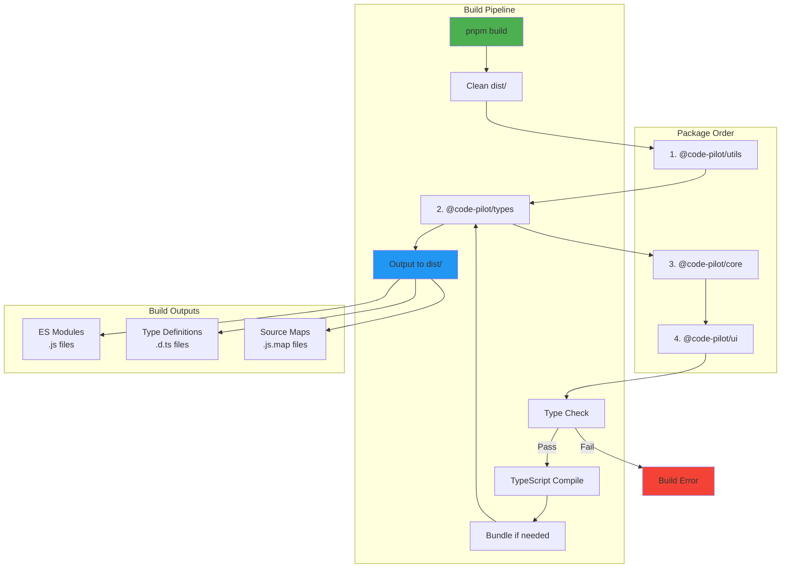
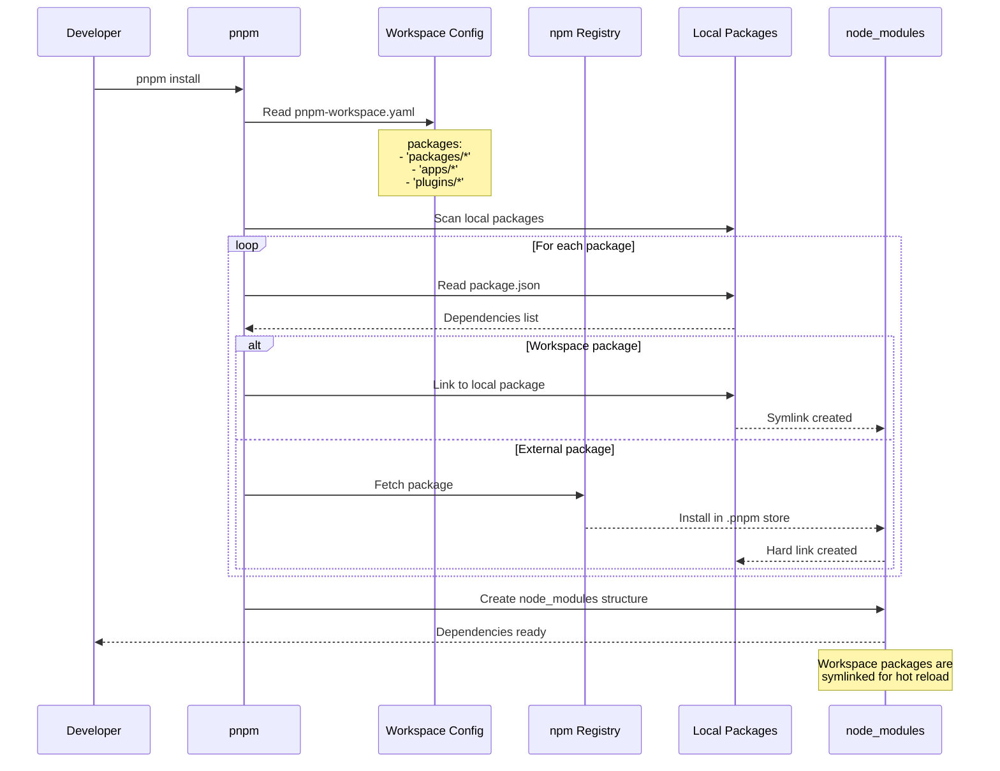

# Packages Directory

This directory contains all shared packages used across Code Pilot Studio v2 applications.

## Overview

The `packages` directory implements a clean architecture approach with clear separation of concerns. Each package has a specific responsibility and can be independently versioned and tested.

```mermaid
graph LR
    subgraph "Package Dependencies"
        A[apps] --> B[@code-pilot/ui]
        A --> C[@code-pilot/core]
        B --> C
        B --> D[@code-pilot/types]
        B --> E[@code-pilot/utils]
        C --> D
        C --> E
        D --> E
        
        subgraph "Core Package"
            C1[Domain Models]
            C2[Business Services]
            C3[Use Cases]
            C4[Repository Interfaces]
        end
        
        subgraph "UI Package"
            B1[Base Components]
            B2[Feature Components]
            B3[Theme System]
            B4[Icons & Styling]
        end
        
        subgraph "Types Package"
            D1[Domain Types]
            D2[API Types]
            D3[IPC Types]
            D4[Common Interfaces]
        end
        
        subgraph "Utils Package"
            E1[String Utils]
            E2[Date Utils]
            E3[File Utils]
            E4[Validation Utils]
        end
        
        C --> C1
        C --> C2
        C --> C3
        C --> C4
        
        B --> B1
        B --> B2
        B --> B3
        B --> B4
        
        D --> D1
        D --> D2
        D --> D3
        D --> D4
        
        E --> E1
        E --> E2
        E --> E3
        E --> E4
    end
    
    style A fill:#FF6B6B,stroke:#CC5555,color:#fff
    style B fill:#4ECDC4,stroke:#3BA99C,color:#fff
    style C fill:#45B7D1,stroke:#3498DB,color:#fff
    style D fill:#96CEB4,stroke:#6FA67C,color:#fff
    style E fill:#FECA57,stroke:#F39C12,color:#fff
```

## Package Structure

```
packages/
├── core/      # Business logic and use cases
├── ui/        # React component library
├── types/     # TypeScript type definitions
└── utils/     # Common utilities and helpers
```

## Packages

### Core (`@code-pilot/core`)

Contains all business logic, domain entities, and use cases:

- Domain models (Project, Session, etc.)
- Business services
- Repository interfaces
- Use case implementations

See [core/README.md](./core/README.md) for details.

### UI (`@code-pilot/ui`)

Shared React component library:

- Base components (Button, Dialog, etc.)
- Feature components (ProjectList, FileTree, etc.)
- Theme system
- Icons and styling

See [ui/README.md](./ui/README.md) for details.

### Types (`@code-pilot/types`)

Shared TypeScript type definitions:

- Domain types
- API types
- IPC types
- Common interfaces

See [types/README.md](./types/README.md) for details.

### Utils (`@code-pilot/utils`)

Common utility functions:

- String manipulation
- Date formatting
- File operations
- Validation helpers

See [utils/README.md](./utils/README.md) for details.

## Architecture Principles

### 1. Clean Architecture

- **Independence**: Packages don't depend on specific frameworks
- **Testability**: Easy to test in isolation
- **Flexibility**: Can swap implementations

### 2. Dependency Direction

```
apps → packages/ui → packages/core → packages/types
         ↓               ↓                ↓
    packages/utils ← packages/utils ← packages/utils
```

### 3. Package Guidelines

- Each package has a single responsibility
- Packages expose a clear public API
- Internal implementation details are hidden
- Types are co-located with their implementations

## Development

### Creating a New Package

1. Create directory under `packages/`
2. Initialize with TypeScript:

   ```bash
   cd packages/my-package
   pnpm init
   pnpm add -D typescript
   ```

3. Add to workspace in root `pnpm-workspace.yaml`
4. Configure `tsconfig.json` extending base config
5. Set up exports in `package.json`:

   ```json
   {
     "main": "./src/index.ts",
     "types": "./src/index.ts"
   }
   ```

### Package Scripts

Each package should have:

```json
{
  "scripts": {
    "dev": "tsc --watch",
    "build": "tsc",
    "lint": "eslint src --ext .ts,.tsx",
    "test": "vitest"
  }
}
```

### Using Packages

Import in other packages or apps:

```typescript
import { ProjectService } from '@code-pilot/core';
import { Button, FileTree } from '@code-pilot/ui';
import type { Project, FileSystemNode } from '@code-pilot/types';
import { formatFileSize, debounce } from '@code-pilot/utils';
```

## Package Build Flow

This diagram shows how packages are built and bundled in the monorepo.



## Dependency Resolution Flow

This diagram illustrates how dependencies are resolved across packages in the workspace.



## Best Practices

1. **Keep packages focused**: One clear purpose per package
2. **Minimize dependencies**: Only add what's necessary
3. **Export everything needed**: But hide internal details
4. **Document exports**: Use JSDoc comments
5. **Test thoroughly**: Aim for high coverage
6. **Version carefully**: Follow semver principles

## Future Packages

Planned additions:

- `@code-pilot/ai` - AI provider abstractions
- `@code-pilot/lsp` - Language server protocol
- `@code-pilot/terminal` - Terminal emulation
- `@code-pilot/git` - Git operations
- `@code-pilot/search` - Advanced search
- `@code-pilot/themes` - Theme definitions
- `@code-pilot/i18n` - Internationalization
