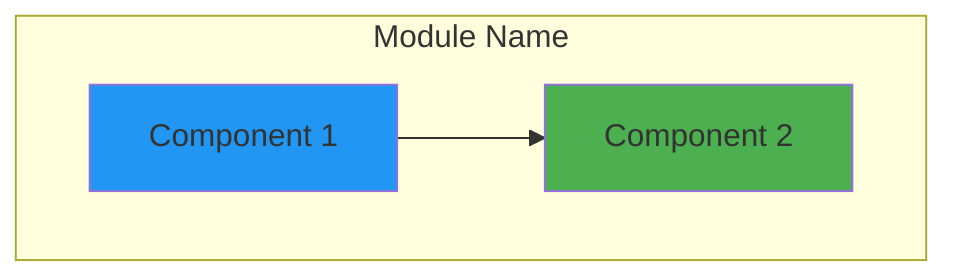

# CLAUDE.md

This file provides guidance to Claude Code (claude.ai/code) when working with code in this repository.

## Project Overview

Code Pilot Studio v2 is an AI-powered IDE built with Tauri (Rust backend + React frontend) using a monorepo architecture. The project follows clean architecture principles with a well-structured monorepo managed by pnpm workspaces and Turborepo. The IDE provides intelligent code assistance, project management, and extensibility through a plugin system.

## Project Structure Overview

```
code-pilot-studio-v2/
├── apps/                # Application packages
│   ├── desktop/         # Main Tauri desktop application
│   │   ├── src/         # React frontend (TypeScript)
│   │   └── src-tauri/   # Rust backend
│   └── web/             # Future web application
├── packages/            # Shared packages
│   ├── core/            # Business logic and services
│   ├── ui/              # Reusable React components
│   ├── types/           # Shared TypeScript types
│   └── utils/           # Common utilities
├── plugins/             # Plugin system packages
│   ├── ai-providers/    # AI integration plugins
│   ├── editors/         # Editor plugins
│   ├── terminals/       # Terminal integration
│   └── version-control/ # Git integration
├── tools/               # Build tools and scripts
├── docs/                # Documentation
└── tests/               # E2E tests
```

## Development Setup Instructions

### Prerequisites

- Node.js 18+ (required for modern JavaScript features)
- pnpm 8+ (package manager with workspace support)
- Rust (latest stable) with cargo
- Tauri CLI (`cargo install tauri-cli`)

### Initial Setup

1. **Clone the repository**:
   ```bash
   git clone <repository-url>
   cd code-pilot-studio-v2
   ```

2. **Install dependencies**:
   ```bash
   pnpm install
   ```

3. **Build all packages**:
   ```bash
   pnpm build
   ```

## Essential Commands

### Development

```bash
# Install dependencies (run from root)
pnpm install

# Start all packages in development mode
pnpm dev

# Run the Tauri desktop app
cd apps/desktop && pnpm tauri:dev
```

### Building

```bash
# Build all packages
pnpm build

# Build desktop app for production
cd apps/desktop && pnpm tauri:build
```

### Code Quality

```bash
# Lint all packages
pnpm lint

# Format code with Prettier
pnpm format

# Run tests
pnpm test

# Clean build artifacts
pnpm clean
```

## Architecture Decisions

### Monorepo Architecture

The project uses a monorepo structure managed by pnpm workspaces and Turborepo for several reasons:

1. **Code Sharing**: Common packages (core, ui, types, utils) are shared across applications
2. **Atomic Changes**: Related changes across packages can be committed together
3. **Consistent Tooling**: Unified build, test, and lint configurations
4. **Simplified Dependencies**: Internal packages are linked automatically

### Clean Architecture Principles

```
┌─────────────────────────────────────────────────────────┐
│                    Presentation Layer                    │
│                  (React Components, UI)                  │
├─────────────────────────────────────────────────────────┤
│                    Application Layer                     │
│                  (Services, Use Cases)                   │
├─────────────────────────────────────────────────────────┤
│                     Domain Layer                         │
│                (Entities, Business Rules)                │
├─────────────────────────────────────────────────────────┤
│                  Infrastructure Layer                    │
│              (Database, File System, APIs)               │
└─────────────────────────────────────────────────────────┘
```

- **Separation of Concerns**: Each layer has a specific responsibility
- **Dependency Rule**: Dependencies only point inward
- **Testability**: Business logic is independent of frameworks
- **Flexibility**: Easy to swap implementations (e.g., different databases)

### Key Architectural Patterns

1. **Clean Architecture**: 
   - Clear separation between UI, business logic, and infrastructure
   - Dependencies flow inward (UI → Services → Domain → Infrastructure)
   - Business logic is framework-agnostic

2. **Repository Pattern**: 
   - `IProjectRepository` interface abstracts data access
   - In-memory implementation ready for SQLite migration
   - Allows easy testing with mock repositories

3. **Service Layer Pattern**:
   - `ProjectService` encapsulates business logic
   - `FileService` handles file system operations
   - `EditorService` manages editor state and operations
   - Services are injected, not instantiated directly

4. **Event-Driven Architecture**:
   - `IEventEmitter` interface for loose coupling
   - File system events trigger UI updates
   - Enables real-time collaboration features (future)

5. **Component-Based UI**:
   - Atomic design with Radix UI primitives
   - Compound components (e.g., FileTree with FileTreeItem)
   - Consistent theming with CSS variables

6. **Type-Safe IPC**:
   - Tauri commands with TypeScript definitions
   - Shared types between frontend and backend
   - Compile-time safety for API calls

### Technology Stack

- **Frontend**:
  - React 18.3, TypeScript, Vite 6
  - Tailwind CSS 4, Radix UI primitives
  - Monaco Editor for code editing
  - Lucide React for icons
- **Backend**:
  - Rust with Tauri 2.0
  - Tokio async runtime
  - SQLx with SQLite (migrations ready)
  - Notify for file watching
- **Build System**: pnpm workspaces + Turborepo
- **Node Version**: 18+

## Key Features Implemented

### Phase 1 - Foundation (Completed)

#### ✅ Monorepo Infrastructure
- pnpm workspace configuration with linked packages
- Turborepo for parallel builds and caching
- TypeScript project references for type safety
- Shared ESLint and Prettier configurations
- Hot module replacement in development

#### ✅ Core Packages
- **@code-pilot/core**: Business logic services
  - ProjectService with CRUD operations
  - FileService with comprehensive file operations
  - EditorService for editor state management
- **@code-pilot/ui**: Reusable React components
  - Complete component library with Radix UI
  - File explorer with tree view
  - Monaco editor integration
  - Project management UI
- **@code-pilot/types**: Shared TypeScript definitions
  - Project, FileSystem, and Editor types
  - IPC command interfaces
- **@code-pilot/utils**: Common utilities
  - Basic structure ready for expansion

### Phase 2 - Core Features (Completed)

#### ✅ Project Management
- Create, read, update, delete projects
- Project validation and error handling
- In-memory storage with UUID generation
- Project settings (git, AI provider, extensions)
- Recent projects sorted by last access
- Project path validation

#### ✅ File System Operations
- **Basic Operations**: read, write, create, delete
- **Advanced Operations**: rename, copy, move
- **Directory Operations**: create, delete (recursive)
- **Search**: File search with filters
  - Query matching (case sensitive/insensitive)
  - File extension filtering
  - Hidden file inclusion
  - Maximum depth control
- **File Watching**: Real-time file system events
  - Create, modify, delete, rename detection
  - Event emission to frontend
- **File Stats**: Size, dates, permissions
- **Home Directory**: Cross-platform resolution

#### ✅ Editor System
- Monaco Editor integration
- Multi-tab support with tab management
- Syntax highlighting for 100+ languages
- File type detection and icons
- Editor settings and configuration
- Status bar with file info

#### ✅ UI/UX Features
- Dark theme with CSS variables
- Responsive layout with ResizePanel
- Context menus for file operations
- Keyboard shortcuts (partially implemented)
- Loading states and error handling
- Toast notifications (ready to implement)

### 🚧 In Progress

- **SQLite Integration**: 
  - Migrations created (`001_create_projects.sql`)
  - SQLx dependencies added
  - Repository pattern ready for implementation
- **Testing Infrastructure**:
  - Vitest configured for unit tests
  - Test structure defined
  - No tests written yet

### 📋 Not Yet Implemented

- **AI Integration**: Provider abstraction ready, no implementations
- **Session Management**: Architecture planned, not started
- **Terminal Integration**: Plugin structure defined
- **Git Operations**: Version control plugin planned
- **Plugin System**: Directory structure created
- **LSP Support**: Not started
- **Authentication**: Not required for Phase 1-2
- **Settings Persistence**: UI ready, backend not implemented

## Testing Instructions

### Running the Application

1. **Development Mode**:
   ```bash
   # Start all packages in dev mode
   pnpm dev
   
   # In another terminal, run the desktop app
   cd apps/desktop
   pnpm tauri:dev
   ```

2. **Production Build**:
   ```bash
   # Build all packages
   pnpm build
   
   # Build desktop app
   cd apps/desktop
   pnpm tauri:build
   ```

### Testing Features

1. **Project Management**:
   - Create new project with name and path
   - Validate that duplicate paths are rejected
   - Update project name and description
   - Delete projects
   - Verify projects persist in memory

2. **File Explorer**:
   - Navigate directories
   - Create files and folders
   - Rename items
   - Delete items (with confirmation)
   - Copy/paste operations
   - Search for files

3. **Editor**:
   - Open multiple files in tabs
   - Switch between tabs
   - Edit and save files
   - Verify syntax highlighting
   - Check file type icons

### Common Development Commands

```bash
# Install dependencies
pnpm install

# Run development servers
pnpm dev

# Build all packages
pnpm build

# Run linting
pnpm lint

# Format code
pnpm format

# Clean build artifacts
pnpm clean

# Run type checking
pnpm typecheck

# Desktop app specific
cd apps/desktop
pnpm tauri:dev      # Development
pnpm tauri:build    # Production build
pnpm tauri:test     # Run tests
```

## Development Guidelines

### Code Organization

1. **Package Structure**:
   ```
   packages/[package-name]/
   ├── src/
   │   ├── index.ts         # Public API exports
   │   ├── [feature]/       # Feature modules
   │   └── __tests__/       # Unit tests
   ├── package.json
   └── tsconfig.json
   ```

2. **Import Guidelines**:
   - Use workspace imports: `@code-pilot/core`
   - Group imports: external, workspace, relative
   - Use barrel exports for clean APIs

3. **TypeScript Best Practices**:
   - No `any` types - use `unknown` if needed
   - Explicit return types for public APIs
   - Use interfaces for contracts
   - Use types for unions/intersections

4. **React Guidelines**:
   - Functional components with hooks
   - Co-locate related components
   - Use compound components pattern
   - Implement error boundaries

5. **State Management**:
   - Local state for component-specific data
   - Context for cross-component state
   - Zustand for global application state (future)

### When implementing features
1. Follow existing patterns (check similar files first)
2. Use appropriate package for the feature:
   - Business logic → `/packages/core/`
   - UI components → `/packages/ui/`
   - Type definitions → `/packages/types/`
   - Shared utilities → `/packages/utils/`
3. Write types first, implementation second
4. Consider error cases and edge conditions
5. Add JSDoc comments for public APIs

### Available Tauri Commands

#### Project Commands
- `create_project(dto: CreateProjectDto)` - Creates a new project
- `get_project(id: string)` - Retrieves a specific project
- `list_projects()` - Lists all projects sorted by last access
- `update_project(id: string, dto: UpdateProjectDto)` - Updates project details
- `delete_project(id: string)` - Deletes a project
- `open_project(id: string)` - Opens a project and updates last access
- `validate_project_path(path: string)` - Validates if path exists and is directory

#### File System Commands
- `read_directory(path: string)` - Lists directory contents
- `read_file(path: string)` - Reads file content as string
- `write_file(path: string, content: string)` - Writes content to file
- `create_file(path: string, content: string)` - Creates new file with content
- `create_directory(path: string)` - Creates directory (recursive)
- `delete_file(path: string)` - Deletes file or directory
- `rename_file(old_path: string, new_path: string)` - Renames/moves file
- `copy_file(source: string, target: string)` - Copies file or directory
- `move_file(source: string, target: string)` - Moves file or directory
- `search_files(options: FileSearchOptions)` - Searches files with filters
- `get_file_stats(path: string)` - Gets file metadata
- `path_exists(path: string)` - Checks if path exists
- `watch_directory(path: string)` - Starts watching directory for changes
- `unwatch_directory(path: string)` - Stops watching directory
- `get_home_dir()` - Gets user's home directory (cross-platform)

## Important Notes

- The project follows a 12-week development roadmap (see REBUILD_PLAN.md)
- Focus on clean architecture and maintainability
- All packages have their own README with specific details and Mermaid diagrams
- File type mappings include 100+ extensions with icons
- The codebase is ready for the next phase of features (AI, sessions, Git)

## README Maintenance Rules

### When to Update READMEs

1. **New Feature Implementation**: Update the relevant package/app README when adding new features
2. **Architecture Changes**: Update Mermaid diagrams when modifying module structure
3. **Dependency Updates**: Keep technology stack sections current
4. **API Changes**: Document new commands, components, or types

### README Structure Standards

1. **Every directory must have a README** with:
   - Overview section explaining the module's purpose
   - Architecture/Component diagram using Mermaid (after the Overview)
   - Structure section showing file organization
   - Usage examples for packages
   - Development instructions

2. **Mermaid Diagrams** should:
   - Be placed after the Overview section
   - Use consistent colors and styling
   - Show relationships between components
   - Be updated when architecture changes

3. **Keep READMEs in sync**:
   - When adding a new component to `/packages/ui/`, update its README
   - When adding a new type to `/packages/types/`, document it
   - When adding Tauri commands, update both the desktop README and CLAUDE.md

### Example Mermaid Diagram Template

