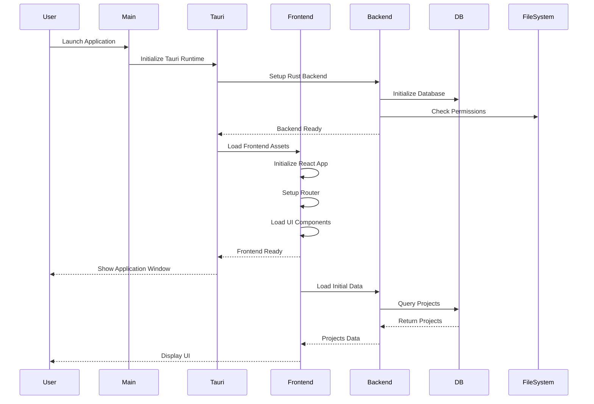
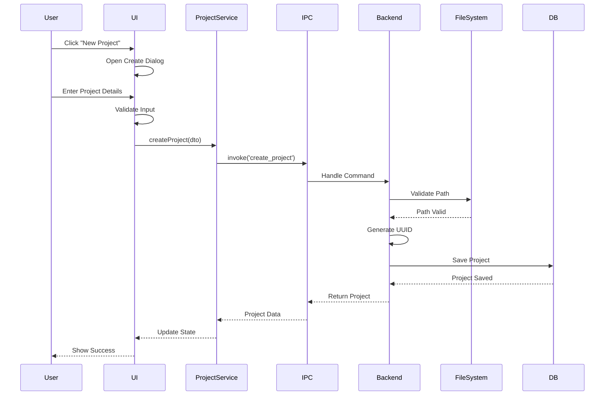
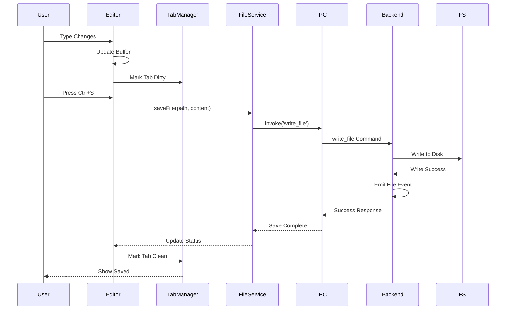
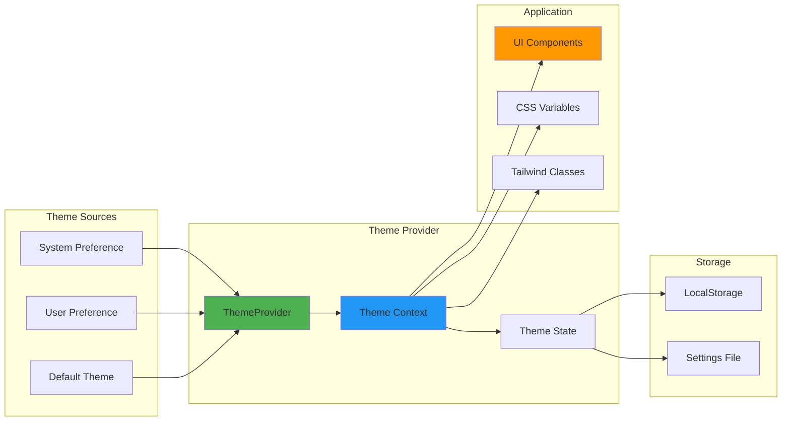
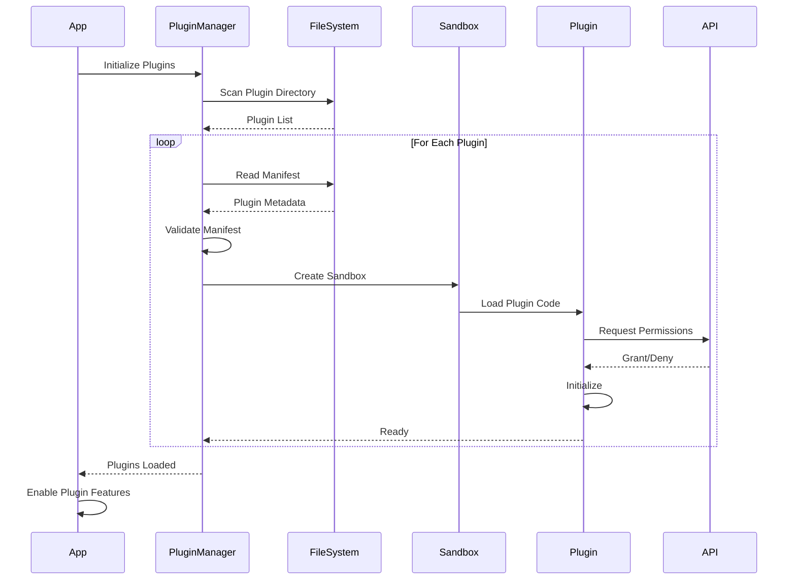
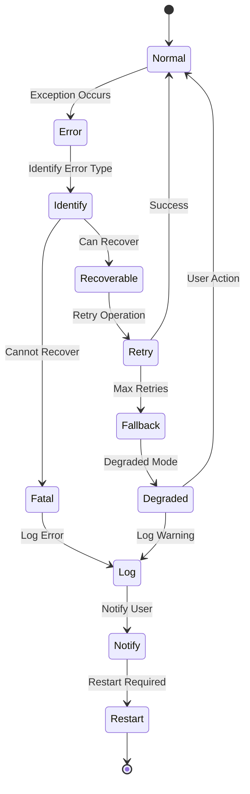

# Code Pilot Studio v2

A next-generation AI-powered IDE built with Tauri, React, and TypeScript. Currently in active development with Phase 3 advanced features in progress.

## Current Project Status

### ✅ Phase 1: Foundation (Completed)

- ✓ Monorepo setup with pnpm workspaces and Turborepo
- ✓ Tauri desktop application with hot reload
- ✓ Core package architecture (core, ui, types, utils)
- ✓ TypeScript project references configuration
- ✓ Build pipeline with Vite

### ✅ Phase 2: Core Features (Completed)

- ✓ Project management system with CRUD operations
- ✓ File explorer with tree view and operations
- ✓ Monaco editor integration with syntax highlighting (20+ languages)
- ✓ Advanced tab management with split panes and drag-and-drop
- ✓ File system operations (create, read, update, delete, copy, move)
- ✓ File watching with real-time updates
- ✓ Theme system with light/dark modes and custom theme support
- ✓ Comprehensive settings system with persistence
- ✓ Configurable keyboard shortcuts

### 🚧 Phase 3: Advanced Features (In Progress)

- 🚧 Terminal integration via `tauri-plugin-terminal` (xterm.js)
- 🚧 Git operations via `tauri-plugin-git` (libgit2)
- 🚧 AI Chat interface with streaming responses
- ☐ SQLite persistence for projects and sessions
- ☐ Plugin system foundation
- ☐ LSP support

### 🔮 Phase 4: AI Integration (Upcoming)

- ☐ Claude CLI integration via `tauri-plugin-claude`
- ☐ Session persistence and recovery
- ☐ MCP config support for tool discovery
- ☐ Multiple concurrent Claude sessions
- ☐ Additional AI providers as plugins

## Architecture

This project uses a monorepo structure with a modular Tauri plugin architecture for core functionality. All major Rust features are implemented as separate Tauri plugins, providing better modularity, reusability, and separation of concerns.

```mermaid
graph TB
    subgraph "Code Pilot Studio v2 Architecture"
        A[Code Pilot Studio] --> B[Apps]
        A --> C[Packages]
        A --> D[Plugins]
        A --> E[Tools]
        
        B --> B1[Desktop App<br/>Tauri + React]
        B --> B2[Web App<br/>Future]
        B --> B3[Mobile App<br/>Future]
        
        C --> C1[@code-pilot/core<br/>Business Logic]
        C --> C2[@code-pilot/ui<br/>React Components]
        C --> C3[@code-pilot/types<br/>TypeScript Types]
        C --> C4[@code-pilot/utils<br/>Utilities]
        
        D --> D1[tauri-plugin-claude]
        D --> D2[tauri-plugin-terminal]
        D --> D3[tauri-plugin-git]
        D --> D4[tauri-plugin-mcp]
        D --> D5[Future Plugins]
        
        E --> E1[Build Tools]
        E --> E2[Scripts]
        E --> E3[Config]
        
        subgraph "Technology Stack"
            F[Frontend<br/>React + TypeScript]
            G[Backend<br/>Rust + Tauri]
            H[Build<br/>Vite + Turborepo]
            I[Package Manager<br/>pnpm workspaces]
        end
        
        B1 --> F
        B1 --> G
        A --> H
        A --> I
        
        C1 -.-> C3
        C1 -.-> C4
        C2 -.-> C1
        C2 -.-> C3
        C2 -.-> C4
    end
    
    style A fill:#1A237E,stroke:#0D47A1,color:#fff
    style B fill:#00695C,stroke:#004D40,color:#fff
    style C fill:#F57C00,stroke:#E65100,color:#fff
    style D fill:#6A1B9A,stroke:#4A148C,color:#fff
    style E fill:#455A64,stroke:#263238,color:#fff
    style F fill:#0288D1,stroke:#01579B,color:#fff
    style G fill:#D32F2F,stroke:#B71C1C,color:#fff
    style H fill:#388E3C,stroke:#1B5E20,color:#fff
    style I fill:#7B1FA2,stroke:#4A148C,color:#fff
```

## Key Operation Flows

### Application Startup Flow



### Project Creation Flow



### File Edit and Save Flow



### Theme System Flow



### Plugin Loading Flow



### Error Recovery Flow



### Project Structure

```text
├── apps/
│   └── desktop/              # Tauri desktop application
│       ├── src/              # React frontend
│       │   └── features/     # Feature modules (editor, terminal, git, ai)
│       └── src-tauri/        # Rust backend
├── packages/
│   ├── core/                 # Core business logic and services
│   ├── ui/                   # Shared UI components library
│   ├── types/                # Shared TypeScript type definitions
│   └── utils/                # Common utilities
├── plugins/                  # Tauri plugins (Rust + TypeScript)
│   ├── tauri-plugin-claude/  # Claude CLI integration
│   │   ├── src/              # Rust plugin code
│   │   └── permissions/      # Permission definitions
│   ├── tauri-plugin-terminal/# Terminal integration (xterm.js)
│   │   ├── src/              # Rust plugin code
│   │   └── permissions/      # Permission definitions
│   ├── tauri-plugin-git/     # Git operations (libgit2)
│   │   ├── src/              # Rust plugin code
│   │   └── permissions/      # Permission definitions
│   └── tauri-plugin-mcp/     # MCP protocol support
│       ├── src/              # Rust plugin code
│       └── permissions/      # Permission definitions
└── tools/                    # Build tools and scripts
```

## Quick Start Guide

### Prerequisites

- Node.js 18+ (for modern JavaScript features)
- pnpm 8+ (package manager)
- Rust (latest stable)
- Tauri CLI 2.0+ (`cargo install tauri-cli --version "^2"`)
- Platform-specific dependencies:
  - **macOS**: Xcode Command Line Tools
  - **Linux**: `webkit2gtk-4.1`, `libssl-dev`, `libgtk-3-dev`
  - **Windows**: Microsoft C++ Build Tools

### Getting Started

1. **Clone and install**:

```bash
git clone <repository-url>
cd launchapp-studio-ide
pnpm install
```

2. **Start development mode**:

```bash
# From the desktop app directory
cd apps/desktop
pnpm tauri:dev

# The app will automatically watch for changes in all packages
```

3. **Build for production**:

```bash
# Build all packages first
pnpm build

# Then build the desktop app
cd apps/desktop
pnpm tauri:build
```

4. **Working with plugins** (optional):

```bash
# Build a specific plugin
cd plugins/tauri-plugin-terminal
cargo build

# Run plugin tests
cargo test
```

## Development Workflow

### Package Development

The monorepo uses pnpm workspaces with the following packages:

- **@code-pilot/core** - Business logic and services
- **@code-pilot/ui** - React components library
- **@code-pilot/types** - Shared TypeScript types
- **@code-pilot/utils** - Common utilities

### Common Tasks

```bash
# Add dependency to a package
pnpm add <package> --filter @code-pilot/core

# Run specific package script
pnpm --filter @code-pilot/ui build

# Update all dependencies
pnpm update --recursive
```

### Development Tips

1. **Hot Reload**: Both frontend and Rust backend support hot reload
2. **Type Safety**: TypeScript runs across all packages with project references
3. **Code Sharing**: Import workspace packages with `@code-pilot/*`
4. **Debugging**: Use Chrome DevTools for frontend, `RUST_LOG=debug` for backend
5. **Plugin Development**: Each plugin has its own Cargo.toml and can be developed independently
6. **Permission System**: Tauri plugins use a fine-grained permission system defined in `permissions/`

## Available Scripts

### Root Scripts

- `pnpm dev` - Start all packages in development mode
- `pnpm build` - Build all packages in dependency order
- `pnpm test` - Run tests across all packages
- `pnpm lint` - Lint all packages with ESLint
- `pnpm format` - Format code with Prettier
- `pnpm clean` - Clean all build artifacts

### Desktop App Scripts

- `pnpm tauri:dev` - Run desktop app in development
- `pnpm tauri:build` - Build desktop app for production
- `pnpm tauri:test` - Run desktop app tests

## Project Features

### Implemented Features

- 📁 **Project Management** - Create and manage multiple projects with workspace support
- 📂 **File Explorer** - Tree view with search, context menus, and drag-and-drop
- ✏️ **Code Editor** - Monaco editor with syntax highlighting for 20+ languages
- 🪟 **Tab Management** - Advanced tabs with split panes and session restoration
- 🎨 **Theme System** - Light/dark modes with custom theme creation
- ⚙️ **Settings System** - Comprehensive preferences with import/export
- 🔄 **File Operations** - Full CRUD operations with copy/move/rename
- 👀 **File Watching** - Real-time file system change detection
- ⌨️ **Keyboard Shortcuts** - Fully configurable key bindings

### In Progress Features

- 🖥️ **Terminal Integration** - xterm.js terminal via `tauri-plugin-terminal`
- 🌐 **Git Integration** - Version control via `tauri-plugin-git` (libgit2)
- 🤖 **AI Chat Interface** - Streaming AI responses with context awareness

### Upcoming Features

- 🧠 **Claude CLI Integration** - Full Claude CLI wrapper via `tauri-plugin-claude`
- 💾 **Session Persistence** - SQLite-based project and session storage
- 🧩 **Plugin System** - Extensible plugin architecture
- 🔍 **Smart Search** - AI-powered code search and navigation
- 📊 **LSP Support** - Language Server Protocol integration
- 🔗 **MCP Support** - Model Context Protocol for AI tools

## Contributing

See [CONTRIBUTING.md](./CONTRIBUTING.md) for contribution guidelines.

## Tech Stack

### Core Technologies

- **Frontend Framework**: React 19 with TypeScript
- **Desktop Framework**: Tauri 2.0 (Rust)
- **Code Editor**: Monaco Editor
- **Terminal**: xterm.js
- **Git Integration**: libgit2
- **Styling**: Tailwind CSS v4
- **UI Components**: Radix UI
- **State Management**: Zustand
- **Build System**: Turborepo + Vite
- **Package Manager**: pnpm workspaces

### Tauri Plugin Architecture

The project uses a modular plugin architecture where each major feature is implemented as a separate Tauri plugin:

- **tauri-plugin-terminal**: Terminal emulation with PTY support
- **tauri-plugin-git**: Git operations using libgit2
- **tauri-plugin-claude**: Claude CLI integration
- **tauri-plugin-mcp**: Model Context Protocol support

Each plugin is self-contained with its own:
- Rust implementation
- TypeScript bindings
- Permission definitions
- Build configuration

## Documentation

- [Architecture Overview](./ARCHITECTURE.md)
- [Development Guide](./CLAUDE.md)
- [Rebuild Plan](./REBUILD_PLAN.md)
- [Terminal & Git Integration Plan](./TERMINAL_GIT_INTEGRATION_PLAN.md)

## License

MIT
