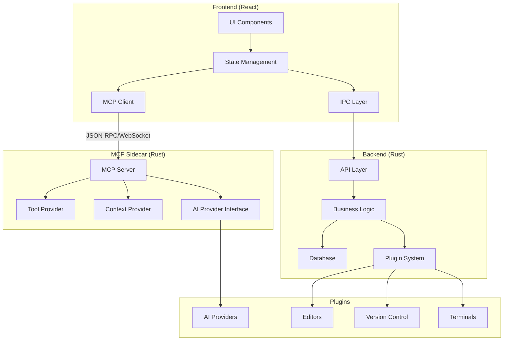
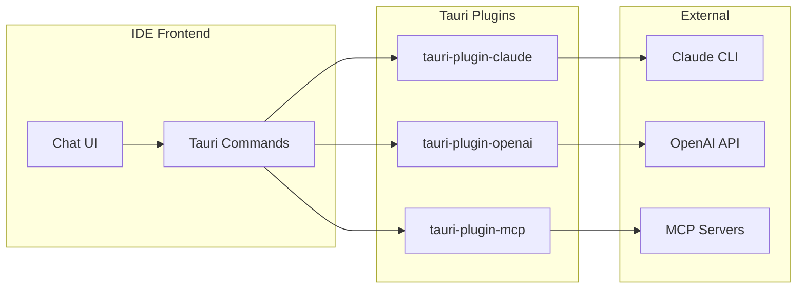

# Code Pilot Studio v2 - Complete Rebuild Plan

**Last Updated**: January 2025  
**Current Status**: Phase 2 Completed, Phase 3 In Progress

## Executive Summary

This document outlines the complete rebuild plan for Code Pilot Studio, transforming it from a prototype into a production-ready, well-architected AI-powered IDE. The rebuild focuses on clean architecture, modularity, and extensibility while maintaining all current features and adding new capabilities.

## Current Progress Summary

### ✅ Completed Phases
- **Phase 1: Foundation** - 100% Complete
- **Phase 2: Core Features** - 100% Complete

### 🚧 In Progress
- **Phase 3: Advanced Features** - Implementing as Tauri Plugins

### 📅 Upcoming
- **Phase 4: Advanced Features**
- **Phase 5: Polish & Optimization**
- **Phase 6: Beta Testing**

## Detailed Progress Report

### Completed Features

#### Infrastructure
- ✅ Monorepo setup with pnpm workspaces and Turborepo
- ✅ TypeScript project references configuration
- ✅ Tauri 2.0 desktop application with hot reload
- ✅ Shared packages: @code-pilot/core, @code-pilot/ui, @code-pilot/types, @code-pilot/utils
- ✅ Build pipeline with Vite 6
- ✅ Type-safe IPC communication layer
- ✅ Comprehensive error handling and logging

#### UI/UX
- ✅ Complete UI component library with Radix UI primitives
- ✅ Dark/Light theme system with CSS variables
- ✅ Custom theme support with theme editor
- ✅ Responsive layout with ResizablePanel components
- ✅ Context menus for file operations
- ✅ Toast notifications system
- ✅ Loading states and skeletons
- ✅ Keyboard shortcuts with customization UI

#### Project Management
- ✅ Create, read, update, delete projects
- ✅ Project validation and path checking
- ✅ Recent projects list with sorting
- ✅ Project settings and configuration
- ✅ In-memory storage (ready for SQLite migration)
- ✅ Project search and filtering

#### File System
- ✅ File explorer with tree view
- ✅ File operations: create, read, update, delete, copy, move, rename
- ✅ Directory operations with recursive support
- ✅ File search with advanced filters
- ✅ File watching with real-time updates
- ✅ File stats and metadata
- ✅ Context menu operations
- ✅ Drag and drop support (partial)

#### Editor System
- ✅ Monaco Editor integration
- ✅ Multi-tab support with tab management
- ✅ Split pane editor layout
- ✅ Syntax highlighting for 100+ languages
- ✅ File type detection with icons
- ✅ Editor settings and configuration
- ✅ Status bar with file information
- ✅ Find and replace (basic)
- ✅ Code folding and minimap

#### Settings System
- ✅ Comprehensive settings UI
- ✅ Settings categories: General, Editor, Appearance, Keyboard
- ✅ Settings persistence to file system
- ✅ Import/Export settings
- ✅ Reset to defaults functionality
- ✅ Live preview of settings changes

### In Development

#### Advanced Features (Phase 3)
- 🚧 Terminal integration via `tauri-plugin-terminal`
- 🚧 Git operations via `tauri-plugin-git`
- ⏳ SQLite database integration
- ⏳ Command palette (advanced)
- ⏳ Tauri plugin architecture implementation

### Not Yet Started

#### AI Integration (Phase 4)
- ❌ Claude CLI integration via `tauri-plugin-claude`
- ❌ Session persistence and recovery mechanisms
- ❌ Log file streaming with file watching
- ❌ Multiple concurrent Claude sessions
- ❌ Process health monitoring and recovery
- ❌ MCP config support for tool discovery
- ❌ Additional AI providers as Tauri plugins
- ❌ OpenAI integration via `tauri-plugin-openai`
- ❌ Generic MCP support via `tauri-plugin-mcp`
- ❌ Response caching and optimization

#### Polish & Optimization (Phase 5)
- ❌ Performance profiling
- ❌ Memory optimization
- ❌ Startup time optimization
- ❌ Comprehensive keyboard navigation
- ❌ Accessibility improvements
- ❌ User documentation
- ❌ Developer documentation

### Technical Debt & Known Issues

1. **Testing**: Test infrastructure is set up but no tests written yet
2. **Database**: SQLite migrations created but not integrated
3. **State Management**: Using local state, need to migrate to Zustand for complex state
4. **Performance**: File tree needs virtualization for large directories
5. **Error Handling**: Need better user-facing error messages
6. **Documentation**: Need to complete API documentation

## Table of Contents

1. [Vision & Goals](#vision--goals)
2. [Architecture Overview](#architecture-overview)
3. [Technology Stack](#technology-stack)
4. [Project Structure](#project-structure)
5. [Core Modules](#core-modules)
6. [Implementation Roadmap](#implementation-roadmap)
7. [Migration Strategy](#migration-strategy)
8. [Success Metrics](#success-metrics)

## Vision & Goals

### Vision
Create a next-generation AI-powered IDE that seamlessly integrates multiple AI assistants, provides intelligent code assistance, and offers a superior developer experience through clean architecture and thoughtful design.

### Primary Goals
- **Clean Architecture**: Implement SOLID principles and clean code practices
- **Modularity**: Build a plugin-based architecture for extensibility
- **Performance**: Optimize for speed and resource efficiency
- **Developer Experience**: Provide intuitive UI/UX with powerful features
- **Maintainability**: Ensure code is easy to understand, test, and modify

### Key Improvements
1. Organized codebase with clear module boundaries
2. Type-safe communication between frontend and backend
3. Comprehensive testing suite
4. Plugin system for extensibility
5. Better state management and data flow
6. Improved error handling and recovery

## Architecture Overview

### Design Principles

1. **Separation of Concerns**
   - UI logic separated from business logic
   - Clear boundaries between modules
   - Dependency injection for testability

2. **Domain-Driven Design**
   - Organize code around business domains
   - Rich domain models
   - Ubiquitous language

3. **Event-Driven Architecture**
   - Loose coupling through events
   - Reactive state management
   - Real-time updates

4. **Plugin Architecture**
   - Core functionality vs plugins
   - Extension points
   - Plugin API

### System Architecture



## Technology Stack

### Frontend
- **Framework**: React 19 with TypeScript
- **Build Tool**: Vite 6
- **State Management**: Zustand with persistence
- **UI Library**: Radix UI primitives
- **Styling**: Tailwind CSS 4
- **Editor**: Monaco Editor with LSP support
- **Terminal**: xterm.js with addons
- **Routing**: React Router v7
- **Data Fetching**: TanStack Query

### Backend
- **Language**: Rust (latest stable)
- **Framework**: Tauri 2.0
- **Async Runtime**: Tokio
- **Database**: SQLite with sqlx
- **Serialization**: Serde
- **Error Handling**: anyhow + thiserror
- **Logging**: tracing

### Development Tools
- **Package Manager**: pnpm with workspaces
- **Testing**: Vitest, Playwright, cargo test
- **Linting**: ESLint, Biome, Clippy
- **Formatting**: Prettier, rustfmt
- **CI/CD**: GitHub Actions

## Project Structure

```
code-pilot-studio-v2/
├── apps/
│   ├── desktop/                 # Tauri desktop application
│   │   ├── src-tauri/          # Rust backend
│   │   │   ├── src/
│   │   │   │   ├── commands/   # Tauri commands
│   │   │   │   ├── db/         # Database layer
│   │   │   │   ├── services/   # Business logic
│   │   │   │   ├── models/     # Domain models
│   │   │   │   ├── plugins/    # Plugin system
│   │   │   │   └── main.rs
│   │   │   ├── migrations/     # SQL migrations
│   │   │   └── Cargo.toml
│   │   ├── src/                # React frontend
│   │   │   ├── components/     # UI components
│   │   │   ├── features/       # Feature modules
│   │   │   ├── hooks/          # Custom hooks
│   │   │   ├── stores/         # Zustand stores
│   │   │   ├── services/       # API services
│   │   │   ├── types/          # TypeScript types
│   │   │   └── main.tsx
│   │   ├── package.json
│   │   └── tsconfig.json
│   ├── mcp-server/             # MCP Server (Rust sidecar)
│   │   ├── src/
│   │   │   ├── server/         # MCP server implementation
│   │   │   ├── providers/      # AI provider integrations
│   │   │   ├── tools/          # Tool implementations
│   │   │   ├── context/        # Context management
│   │   │   ├── transport/      # JSON-RPC transport
│   │   │   └── main.rs
│   │   ├── Cargo.toml
│   │   └── README.md
│   └── web/                    # Future web version
├── packages/                   # Shared packages
│   ├── core/                   # Core business logic
│   │   ├── src/
│   │   │   ├── entities/       # Domain entities
│   │   │   ├── use-cases/      # Business use cases
│   │   │   └── interfaces/     # Port interfaces
│   │   └── package.json
│   ├── ui/                     # Shared UI components
│   │   ├── src/
│   │   │   ├── components/     # Reusable components
│   │   │   ├── themes/         # Theme definitions
│   │   │   └── utils/          # UI utilities
│   │   └── package.json
│   ├── types/                  # Shared TypeScript types
│   │   ├── src/
│   │   │   ├── api/            # API types
│   │   │   ├── domain/         # Domain types
│   │   │   ├── ipc/            # IPC types
│   │   │   └── mcp/            # MCP protocol types
│   │   └── package.json
│   ├── mcp-client/             # MCP TypeScript client
│   │   ├── src/
│   │   │   ├── client.ts       # MCP client implementation
│   │   │   ├── transport.ts    # WebSocket transport
│   │   │   └── types.ts        # Client types
│   │   └── package.json
│   └── utils/                  # Shared utilities
│       ├── src/
│       └── package.json
├── plugins/                    # Plugin packages
│   ├── ai-providers/
│   │   ├── claude/
│   │   ├── openai/
│   │   └── README.md
│   ├── editors/
│   │   ├── monaco/
│   │   └── codemirror/
│   ├── terminals/
│   │   ├── xterm/
│   │   └── tmux/
│   └── version-control/
│       └── git/
├── tools/                      # Development tools
│   ├── scripts/                # Build scripts
│   └── config/                 # Shared configs
├── docs/                       # Documentation
│   ├── architecture/
│   ├── api/
│   ├── mcp/                    # MCP documentation
│   └── plugins/
├── tests/                      # E2E tests
├── pnpm-workspace.yaml
├── turbo.json                  # Turborepo config
└── README.md
```

## Core Modules

### 1. Project Management Module

**Purpose**: Handle project lifecycle, workspace management, and templates

**Features**:
- Project creation with templates
- Git worktree-based isolation
- Project settings and configuration
- Multi-project workspace support
- Project search and filtering

**Components**:
```typescript
interface ProjectManager {
  createProject(config: ProjectConfig): Promise<Project>
  openProject(id: string): Promise<Project>
  deleteProject(id: string): Promise<void>
  listProjects(): Promise<Project[]>
  createWorktree(projectId: string, branch: string): Promise<Worktree>
}
```

### 2. Session Management Module

**Purpose**: Manage AI conversation sessions with persistence and recovery

**Features**:
- Session creation and persistence
- Conversation history with branching
- Session templates and presets
- Auto-save and recovery
- Session sharing and export

**Components**:
```typescript
interface SessionManager {
  createSession(config: SessionConfig): Promise<Session>
  loadSession(id: string): Promise<Session>
  saveSession(session: Session): Promise<void>
  listSessions(filter?: SessionFilter): Promise<Session[]>
  recoverSession(id: string): Promise<Session>
}
```

### 3. AI Integration Module

**Purpose**: Provide AI capabilities through Claude CLI integration and support for additional providers

**Features**:
- Claude CLI wrapper with proven subprocess management
- Session persistence and recovery
- Log file streaming with real-time updates
- Multiple concurrent Claude sessions
- Process health monitoring
- MCP config support for tool discovery
- Extensible provider system

**Architecture**:



**Claude Plugin Components**:
```rust
// tauri-plugin-claude implementation
pub struct ClaudeService {
    sessions: HashMap<String, Session>,
    process_manager: ProcessManager,
    file_watcher: FileWatcher,
}

impl ClaudeService {
    pub async fn create_session(&mut self, config: SessionConfig) -> Result<Session> {
        // Spawn Claude CLI with proper flags
        let cmd = format!(
            "claude -p '{}' --verbose --output-format stream-json \
             --permission-mode bypassPermissions | tee '{}'",
            config.prompt, config.log_path
        );
        
        let process = self.process_manager.spawn(cmd)?;
        let session = Session::new(process.id, config);
        
        // Setup file watching for real-time updates
        self.file_watcher.watch(&session.log_path)?;
        
        self.sessions.insert(session.id.clone(), session);
        Ok(session)
    }
    
    pub async fn recover_sessions(&mut self) -> Result<Vec<Session>> {
        // Scan for existing log files and recover sessions
        let sessions = self.scan_session_directory()?;
        for session in sessions {
            self.recover_session(session)?;
        }
        Ok(recovered)
    }
}
```

**Frontend Usage**:
```typescript
// Direct invocation via Tauri commands
import { invoke } from '@tauri-apps/api/core';

interface ClaudeSession {
  id: string;
  workspacePath: string;
  status: 'idle' | 'streaming' | 'failed';
}

// Create new Claude session
const session = await invoke<ClaudeSession>('plugin:claude|create_session', {
  workspacePath: '/path/to/workspace',
  prompt: 'Initial prompt'
});

// Send input to existing session
const response = await invoke('plugin:claude|send_input', {
  sessionId: session.id,
  input: 'User message'
});

// Recover sessions on app start
const recovered = await invoke<ClaudeSession[]>('plugin:claude|recover_sessions');
```

### 4. Editor System Module

**Purpose**: Provide advanced code editing capabilities

**Features**:
- Multi-tab editing with split panes
- Syntax highlighting for 100+ languages
- LSP integration for intellisense
- Code folding and minimap
- Find and replace with regex
- Multiple cursors and selections
- Vim/Emacs key bindings

**Components**:
- Editor core with Monaco
- Tab management system
- Layout manager
- Theme system

### 5. Terminal Integration Module

**Purpose**: Integrate terminal functionality within the IDE

**Features**:
- Multiple terminal instances
- Tmux integration with control mode
- Session recording and playback
- Command history and search
- Custom shell integration
- Split panes

**Implementation**:
```typescript
interface TerminalProvider {
  createTerminal(config: TerminalConfig): Terminal
  attachToSession(sessionId: string): Terminal
  recordSession(terminal: Terminal): SessionRecording
}
```

### 6. Extension System Module

**Purpose**: Enable third-party extensions and customization

**Features**:
- Extension API with sandboxing
- Extension marketplace
- Hot reload during development
- Settings and keybindings
- Custom themes and icons
- Language support extensions

**API Design**:
```typescript
interface Extension {
  id: string
  name: string
  version: string
  activate(context: ExtensionContext): void
  deactivate(): void
}

interface ExtensionAPI {
  registerCommand(id: string, handler: CommandHandler): void
  registerProvider(type: string, provider: any): void
  showMessage(message: string, type: MessageType): void
}
```

### 7. File System Module

**Purpose**: Abstract file system operations with virtual file support

**Features**:
- Virtual file system for unsaved changes
- File watching and auto-reload
- Binary file preview
- Large file handling
- Remote file system support

### 8. Version Control Module

**Purpose**: Integrate version control operations

**Features**:
- Git integration with libgit2
- Visual diff viewer
- Commit history browser
- Branch management
- Merge conflict resolution
- GitHub/GitLab integration

## Implementation Roadmap

### Phase 1: Foundation (Weeks 1-2) ✅ COMPLETED

**Goal**: Set up project structure and core infrastructure

**Completed Tasks**:
1. ✅ Initialize monorepo with pnpm workspaces
2. ✅ Set up Tauri project with TypeScript
3. ✅ Configure build tools (Vite, Turbo)
4. ✅ Implement basic IPC communication
5. ✅ Create UI component library foundation
6. ✅ Set up testing infrastructure (Vitest configured)
7. ✅ Implement logging and error handling

**Delivered**:
- ✅ Working Tauri app with hot reload
- ✅ Complete component library with Radix UI
- ✅ Type-safe IPC with TypeScript definitions
- ✅ Monorepo build pipeline with Turborepo

### Phase 2: Core Features (Weeks 3-4) ✅ COMPLETED

**Goal**: Implement essential IDE features

**Completed Tasks**:
1. ✅ Project management system with CRUD operations
2. ✅ File explorer with tree view and context menus
3. ✅ Monaco editor with syntax highlighting for 100+ languages
4. ✅ Advanced tab management with split panes
5. ✅ Comprehensive settings and preferences system
6. ✅ Theme system (light/dark/custom themes)
7. ✅ Keyboard shortcuts system with customization

**Delivered**:
- ✅ Full-featured file explorer with search and file operations
- ✅ Monaco editor integration with tabs
- ✅ Settings persistence with UI
- ✅ Theme switching with custom theme support
- ✅ File watching and real-time updates
- ✅ Status bar with file information
- ✅ Command palette (basic implementation)

### Phase 3: Advanced Features (Weeks 5-6) 🚧 IN PROGRESS

**Goal**: Implement terminal and version control as Tauri plugins

**Tasks**:
1. 🚧 Create `tauri-plugin-terminal` with xterm.js frontend
2. 🚧 Create `tauri-plugin-git` with libgit2 backend
3. ⏳ Implement PTY management in terminal plugin
4. ⏳ Git operations (status, diff, commit, branch)
5. ⏳ Terminal session management
6. ⏳ Git UI components (diff viewer, staging)
7. ⏳ SQLite persistence layer

**Target Deliverables**:
- Modular Tauri plugins for terminal and git
- Full terminal functionality with PTY support
- Complete git integration with UI
- Database persistence for projects

### Phase 4: AI Integration (Weeks 7-8)

**Goal**: Integrate AI capabilities through Tauri plugins

**Tasks**:
1. Create `tauri-plugin-claude` with CLI wrapper
   - Port existing Claude CLI integration
   - Session persistence and recovery
   - Log file streaming with file watching
   - Process lifecycle management
   - MCP config support
2. Implement session management
   - Multiple concurrent sessions
   - Session recovery on app restart
   - Health monitoring and orphan detection
3. Create chat UI components
   - Streaming message display
   - Session management UI
   - Tool discovery from MCP configs
4. Additional AI provider plugins
   - `tauri-plugin-openai` for OpenAI API
   - `tauri-plugin-mcp` for generic MCP support
5. Response caching and optimization

**Deliverables**:
- Working Claude integration via CLI wrapper
- Session persistence and recovery
- Multiple AI provider support via plugins
- MCP tool discovery and execution
- Robust process management

### Phase 5: Polish & Optimization (Weeks 9-10)

**Goal**: Optimize performance and polish UX

**Tasks**:
1. Performance profiling and optimization
2. Memory usage optimization
3. Startup time improvement
4. Error recovery mechanisms
5. Comprehensive keyboard navigation
6. Accessibility improvements
7. Documentation and tutorials

**Deliverables**:
- Performance benchmarks
- User documentation
- Developer documentation
- Release builds

### Phase 6: Beta Testing (Weeks 11-12)

**Goal**: Test with real users and iterate

**Tasks**:
1. Beta release preparation
2. User feedback collection
3. Bug fixes and improvements
4. Performance monitoring
5. Security audit
6. Final documentation
7. Marketing website

**Deliverables**:
- Beta release
- Feedback system
- Bug tracker
- Public website

## Migration Strategy

### Data Migration

1. **Session Data**
   - Export existing sessions to JSON
   - Transform to new schema
   - Import with validation

2. **Project Settings**
   - Map old settings to new structure
   - Provide migration wizard
   - Backup original data

3. **User Preferences**
   - Automatic preference migration
   - Reset to defaults option
   - Import/export functionality

### Feature Parity Checklist

- [x] Project management
- [ ] Session persistence
- [ ] AI chat interface
- [x] File explorer
- [x] Code editor
- [ ] Terminal integration
- [ ] Git operations
- [x] Theme support
- [x] Settings management
- [x] Keyboard shortcuts

### Rollback Plan

1. Keep old version available
2. Data export functionality
3. Clear migration documentation
4. Support overlap period

## Success Metrics

### Performance Metrics
- **Startup Time**: < 2 seconds
- **Memory Usage**: < 200MB idle
- **Response Time**: < 100ms for UI operations
- **File Operations**: < 50ms for open/save

### Code Quality Metrics
- **Test Coverage**: > 80%
- **TypeScript Coverage**: 100%
- **Bundle Size**: < 50MB
- **Lighthouse Score**: > 95

### User Experience Metrics
- **Time to First Interaction**: < 3 seconds
- **Crash Rate**: < 0.1%
- **User Satisfaction**: > 4.5/5
- **Feature Adoption**: > 70%

### Development Metrics
- **Build Time**: < 2 minutes
- **Test Execution**: < 5 minutes
- **Deploy Time**: < 10 minutes
- **PR Review Time**: < 24 hours

## Risk Management

### Technical Risks
1. **Tauri API Changes**
   - Mitigation: Pin versions, follow changelog
2. **Performance Issues**
   - Mitigation: Regular profiling, benchmarks
3. **Extension Security**
   - Mitigation: Sandboxing, code review

### Project Risks
1. **Scope Creep**
   - Mitigation: Strict phase boundaries
2. **Timeline Delays**
   - Mitigation: Buffer time, parallel work
3. **Technical Debt**
   - Mitigation: Regular refactoring sprints

## Conclusion

This rebuild plan provides a clear path to transform Code Pilot Studio from a prototype into a production-ready, well-architected application. By following clean architecture principles and implementing a modular design, we'll create a maintainable and extensible IDE that can grow with user needs.

The phased approach ensures we can deliver value incrementally while maintaining high quality standards. Each phase builds upon the previous one, allowing for continuous testing and feedback integration.

Success will be measured not just by feature completeness, but by code quality, performance, and user satisfaction. The end result will be a professional-grade AI-powered IDE that sets a new standard for developer tools.

---

**Document Version**: 1.1  
**Last Updated**: January 2025  
**Status**: In Active Development - Phase 3

## Next Immediate Steps

### Phase 3: Create Tauri Plugins

1. **Terminal Plugin (`tauri-plugin-terminal`)**
   ```bash
   npx @tauri-apps/cli plugin new terminal --no-api
   mv tauri-plugin-terminal plugins/
   ```
   - Implement PTY management with `portable-pty`
   - Create terminal session manager
   - Add xterm.js frontend components
   - Handle resize, input/output streaming

2. **Git Plugin (`tauri-plugin-git`)**
   ```bash
   npx @tauri-apps/cli plugin new git --no-api
   mv tauri-plugin-git plugins/
   ```
   - Integrate libgit2-rs
   - Implement core git operations
   - Create diff/status/commit commands
   - Build UI components for git panel

3. **SQLite Integration**
   - Continue with existing approach in main app
   - Integrate migrations from `src-tauri/migrations`
   - Replace in-memory project storage

### Phase 4: AI Integration Plugins

1. **Claude Plugin (`tauri-plugin-claude`)**
   ```bash
   npx @tauri-apps/cli plugin new claude --no-api
   mv tauri-plugin-claude plugins/
   ```
   - Port `claude_service.rs` from old IDE
   - Implement session management
   - Add file watching for log streaming
   - Handle process lifecycle

2. **Additional AI Plugins**
   - `tauri-plugin-openai`: Direct API integration
   - `tauri-plugin-mcp`: Generic MCP client

### Implementation Priority

1. Terminal plugin (essential for development)
2. Git plugin (version control integration)
3. Claude plugin (AI assistance)
4. SQLite persistence
5. Additional AI providers

See [TERMINAL_GIT_INTEGRATION_PLAN.md](./TERMINAL_GIT_INTEGRATION_PLAN.md) for detailed terminal/git implementation.