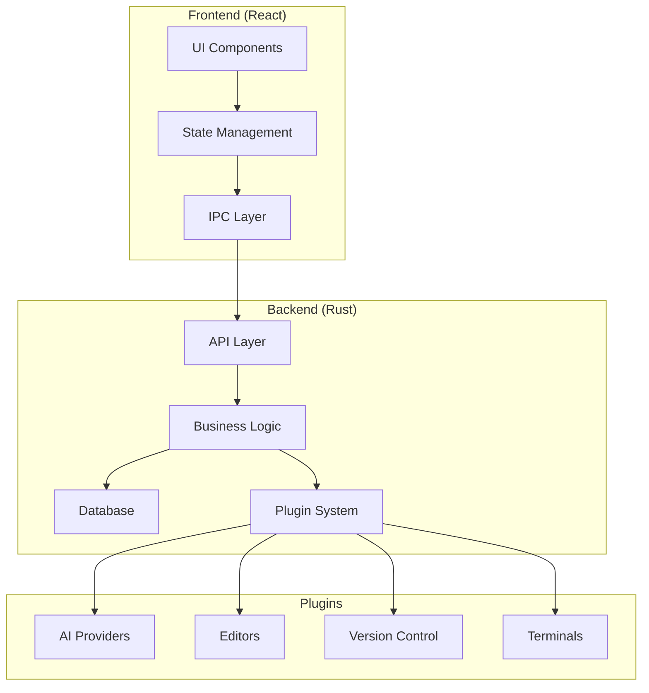

# Code Pilot Studio v2 - Complete Rebuild Plan

## Executive Summary

This document outlines the complete rebuild plan for Code Pilot Studio, transforming it from a prototype into a production-ready, well-architected AI-powered IDE. The rebuild focuses on clean architecture, modularity, and extensibility while maintaining all current features and adding new capabilities.

## Table of Contents

1. [Vision & Goals](#vision--goals)
2. [Architecture Overview](#architecture-overview)
3. [Technology Stack](#technology-stack)
4. [Project Structure](#project-structure)
5. [Core Modules](#core-modules)
6. [Implementation Roadmap](#implementation-roadmap)
7. [Migration Strategy](#migration-strategy)
8. [Success Metrics](#success-metrics)

## Vision & Goals

### Vision
Create a next-generation AI-powered IDE that seamlessly integrates multiple AI assistants, provides intelligent code assistance, and offers a superior developer experience through clean architecture and thoughtful design.

### Primary Goals
- **Clean Architecture**: Implement SOLID principles and clean code practices
- **Modularity**: Build a plugin-based architecture for extensibility
- **Performance**: Optimize for speed and resource efficiency
- **Developer Experience**: Provide intuitive UI/UX with powerful features
- **Maintainability**: Ensure code is easy to understand, test, and modify

### Key Improvements
1. Organized codebase with clear module boundaries
2. Type-safe communication between frontend and backend
3. Comprehensive testing suite
4. Plugin system for extensibility
5. Better state management and data flow
6. Improved error handling and recovery

## Architecture Overview

### Design Principles

1. **Separation of Concerns**
   - UI logic separated from business logic
   - Clear boundaries between modules
   - Dependency injection for testability

2. **Domain-Driven Design**
   - Organize code around business domains
   - Rich domain models
   - Ubiquitous language

3. **Event-Driven Architecture**
   - Loose coupling through events
   - Reactive state management
   - Real-time updates

4. **Plugin Architecture**
   - Core functionality vs plugins
   - Extension points
   - Plugin API

### System Architecture



## Technology Stack

### Frontend
- **Framework**: React 19 with TypeScript
- **Build Tool**: Vite 6
- **State Management**: Zustand with persistence
- **UI Library**: Radix UI primitives
- **Styling**: Tailwind CSS 4
- **Editor**: Monaco Editor with LSP support
- **Terminal**: xterm.js with addons
- **Routing**: React Router v7
- **Data Fetching**: TanStack Query

### Backend
- **Language**: Rust (latest stable)
- **Framework**: Tauri 2.0
- **Async Runtime**: Tokio
- **Database**: SQLite with sqlx
- **Serialization**: Serde
- **Error Handling**: anyhow + thiserror
- **Logging**: tracing

### Development Tools
- **Package Manager**: pnpm with workspaces
- **Testing**: Vitest, Playwright, cargo test
- **Linting**: ESLint, Biome, Clippy
- **Formatting**: Prettier, rustfmt
- **CI/CD**: GitHub Actions

## Project Structure

```
code-pilot-studio-v2/
├── apps/
│   ├── desktop/                 # Tauri desktop application
│   │   ├── src-tauri/          # Rust backend
│   │   │   ├── src/
│   │   │   │   ├── commands/   # Tauri commands
│   │   │   │   ├── db/         # Database layer
│   │   │   │   ├── services/   # Business logic
│   │   │   │   ├── models/     # Domain models
│   │   │   │   ├── plugins/    # Plugin system
│   │   │   │   └── main.rs
│   │   │   ├── migrations/     # SQL migrations
│   │   │   └── Cargo.toml
│   │   ├── src/                # React frontend
│   │   │   ├── components/     # UI components
│   │   │   ├── features/       # Feature modules
│   │   │   ├── hooks/          # Custom hooks
│   │   │   ├── stores/         # Zustand stores
│   │   │   ├── services/       # API services
│   │   │   ├── types/          # TypeScript types
│   │   │   └── main.tsx
│   │   ├── package.json
│   │   └── tsconfig.json
│   └── web/                    # Future web version
├── packages/                   # Shared packages
│   ├── core/                   # Core business logic
│   │   ├── src/
│   │   │   ├── entities/       # Domain entities
│   │   │   ├── use-cases/      # Business use cases
│   │   │   └── interfaces/     # Port interfaces
│   │   └── package.json
│   ├── ui/                     # Shared UI components
│   │   ├── src/
│   │   │   ├── components/     # Reusable components
│   │   │   ├── themes/         # Theme definitions
│   │   │   └── utils/          # UI utilities
│   │   └── package.json
│   ├── types/                  # Shared TypeScript types
│   │   ├── src/
│   │   │   ├── api/            # API types
│   │   │   ├── domain/         # Domain types
│   │   │   └── ipc/            # IPC types
│   │   └── package.json
│   └── utils/                  # Shared utilities
│       ├── src/
│       └── package.json
├── plugins/                    # Plugin packages
│   ├── ai-providers/
│   │   ├── claude/
│   │   ├── openai/
│   │   └── README.md
│   ├── editors/
│   │   ├── monaco/
│   │   └── codemirror/
│   ├── terminals/
│   │   ├── xterm/
│   │   └── tmux/
│   └── version-control/
│       └── git/
├── tools/                      # Development tools
│   ├── scripts/                # Build scripts
│   └── config/                 # Shared configs
├── docs/                       # Documentation
│   ├── architecture/
│   ├── api/
│   └── plugins/
├── tests/                      # E2E tests
├── pnpm-workspace.yaml
├── turbo.json                  # Turborepo config
└── README.md
```

## Core Modules

### 1. Project Management Module

**Purpose**: Handle project lifecycle, workspace management, and templates

**Features**:
- Project creation with templates
- Git worktree-based isolation
- Project settings and configuration
- Multi-project workspace support
- Project search and filtering

**Components**:
```typescript
interface ProjectManager {
  createProject(config: ProjectConfig): Promise<Project>
  openProject(id: string): Promise<Project>
  deleteProject(id: string): Promise<void>
  listProjects(): Promise<Project[]>
  createWorktree(projectId: string, branch: string): Promise<Worktree>
}
```

### 2. Session Management Module

**Purpose**: Manage AI conversation sessions with persistence and recovery

**Features**:
- Session creation and persistence
- Conversation history with branching
- Session templates and presets
- Auto-save and recovery
- Session sharing and export

**Components**:
```typescript
interface SessionManager {
  createSession(config: SessionConfig): Promise<Session>
  loadSession(id: string): Promise<Session>
  saveSession(session: Session): Promise<void>
  listSessions(filter?: SessionFilter): Promise<Session[]>
  recoverSession(id: string): Promise<Session>
}
```

### 3. AI Integration Module

**Purpose**: Provide unified interface for multiple AI providers

**Features**:
- Provider abstraction layer
- Streaming response handling
- Context window management
- Tool/function calling
- Token usage tracking
- Response caching

**Architecture**:
```typescript
interface AIProvider {
  name: string
  chat(messages: Message[], options: ChatOptions): AsyncIterator<ChatResponse>
  complete(prompt: string, options: CompletionOptions): Promise<string>
  embeddings(texts: string[]): Promise<number[][]>
}

class AIManager {
  registerProvider(provider: AIProvider): void
  getProvider(name: string): AIProvider
  setDefaultProvider(name: string): void
}
```

### 4. Editor System Module

**Purpose**: Provide advanced code editing capabilities

**Features**:
- Multi-tab editing with split panes
- Syntax highlighting for 100+ languages
- LSP integration for intellisense
- Code folding and minimap
- Find and replace with regex
- Multiple cursors and selections
- Vim/Emacs key bindings

**Components**:
- Editor core with Monaco
- Tab management system
- Layout manager
- Theme system

### 5. Terminal Integration Module

**Purpose**: Integrate terminal functionality within the IDE

**Features**:
- Multiple terminal instances
- Tmux integration with control mode
- Session recording and playback
- Command history and search
- Custom shell integration
- Split panes

**Implementation**:
```typescript
interface TerminalProvider {
  createTerminal(config: TerminalConfig): Terminal
  attachToSession(sessionId: string): Terminal
  recordSession(terminal: Terminal): SessionRecording
}
```

### 6. Extension System Module

**Purpose**: Enable third-party extensions and customization

**Features**:
- Extension API with sandboxing
- Extension marketplace
- Hot reload during development
- Settings and keybindings
- Custom themes and icons
- Language support extensions

**API Design**:
```typescript
interface Extension {
  id: string
  name: string
  version: string
  activate(context: ExtensionContext): void
  deactivate(): void
}

interface ExtensionAPI {
  registerCommand(id: string, handler: CommandHandler): void
  registerProvider(type: string, provider: any): void
  showMessage(message: string, type: MessageType): void
}
```

### 7. File System Module

**Purpose**: Abstract file system operations with virtual file support

**Features**:
- Virtual file system for unsaved changes
- File watching and auto-reload
- Binary file preview
- Large file handling
- Remote file system support

### 8. Version Control Module

**Purpose**: Integrate version control operations

**Features**:
- Git integration with libgit2
- Visual diff viewer
- Commit history browser
- Branch management
- Merge conflict resolution
- GitHub/GitLab integration

## Implementation Roadmap

### Phase 1: Foundation (Weeks 1-2)

**Goal**: Set up project structure and core infrastructure

**Tasks**:
1. Initialize monorepo with pnpm workspaces
2. Set up Tauri project with TypeScript
3. Configure build tools (Vite, Turbo)
4. Implement basic IPC communication
5. Create UI component library foundation
6. Set up testing infrastructure
7. Implement logging and error handling

**Deliverables**:
- Working Tauri app with hot reload
- Basic component library
- IPC type safety
- CI/CD pipeline

### Phase 2: Core Features (Weeks 3-4)

**Goal**: Implement essential IDE features

**Tasks**:
1. Project management system
2. File explorer with tree view
3. Basic editor with syntax highlighting
4. Tab management system
5. Settings and preferences
6. Theme system (light/dark)
7. Keyboard shortcuts system

**Deliverables**:
- Functional file explorer
- Working code editor
- Settings persistence
- Theme switching

### Phase 3: AI Integration (Weeks 5-6)

**Goal**: Integrate AI capabilities

**Tasks**:
1. AI provider abstraction layer
2. Claude API integration
3. Streaming chat interface
4. Context management system
5. Tool calling implementation
6. Token usage tracking
7. Response caching layer

**Deliverables**:
- Working AI chat
- Multiple provider support
- Context awareness
- Tool execution

### Phase 4: Advanced Features (Weeks 7-8)

**Goal**: Implement advanced IDE features

**Tasks**:
1. Session management with persistence
2. Git integration and diff viewer
3. Terminal integration with xterm
4. LSP client implementation
5. Search and replace functionality
6. Extension system foundation
7. Command palette

**Deliverables**:
- Session history
- Git operations
- Integrated terminal
- Code intelligence

### Phase 5: Polish & Optimization (Weeks 9-10)

**Goal**: Optimize performance and polish UX

**Tasks**:
1. Performance profiling and optimization
2. Memory usage optimization
3. Startup time improvement
4. Error recovery mechanisms
5. Comprehensive keyboard navigation
6. Accessibility improvements
7. Documentation and tutorials

**Deliverables**:
- Performance benchmarks
- User documentation
- Developer documentation
- Release builds

### Phase 6: Beta Testing (Weeks 11-12)

**Goal**: Test with real users and iterate

**Tasks**:
1. Beta release preparation
2. User feedback collection
3. Bug fixes and improvements
4. Performance monitoring
5. Security audit
6. Final documentation
7. Marketing website

**Deliverables**:
- Beta release
- Feedback system
- Bug tracker
- Public website

## Migration Strategy

### Data Migration

1. **Session Data**
   - Export existing sessions to JSON
   - Transform to new schema
   - Import with validation

2. **Project Settings**
   - Map old settings to new structure
   - Provide migration wizard
   - Backup original data

3. **User Preferences**
   - Automatic preference migration
   - Reset to defaults option
   - Import/export functionality

### Feature Parity Checklist

- [ ] Project management
- [ ] Session persistence
- [ ] AI chat interface
- [ ] File explorer
- [ ] Code editor
- [ ] Terminal integration
- [ ] Git operations
- [ ] Theme support
- [ ] Settings management
- [ ] Keyboard shortcuts

### Rollback Plan

1. Keep old version available
2. Data export functionality
3. Clear migration documentation
4. Support overlap period

## Success Metrics

### Performance Metrics
- **Startup Time**: < 2 seconds
- **Memory Usage**: < 200MB idle
- **Response Time**: < 100ms for UI operations
- **File Operations**: < 50ms for open/save

### Code Quality Metrics
- **Test Coverage**: > 80%
- **TypeScript Coverage**: 100%
- **Bundle Size**: < 50MB
- **Lighthouse Score**: > 95

### User Experience Metrics
- **Time to First Interaction**: < 3 seconds
- **Crash Rate**: < 0.1%
- **User Satisfaction**: > 4.5/5
- **Feature Adoption**: > 70%

### Development Metrics
- **Build Time**: < 2 minutes
- **Test Execution**: < 5 minutes
- **Deploy Time**: < 10 minutes
- **PR Review Time**: < 24 hours

## Risk Management

### Technical Risks
1. **Tauri API Changes**
   - Mitigation: Pin versions, follow changelog
2. **Performance Issues**
   - Mitigation: Regular profiling, benchmarks
3. **Extension Security**
   - Mitigation: Sandboxing, code review

### Project Risks
1. **Scope Creep**
   - Mitigation: Strict phase boundaries
2. **Timeline Delays**
   - Mitigation: Buffer time, parallel work
3. **Technical Debt**
   - Mitigation: Regular refactoring sprints

## Conclusion

This rebuild plan provides a clear path to transform Code Pilot Studio from a prototype into a production-ready, well-architected application. By following clean architecture principles and implementing a modular design, we'll create a maintainable and extensible IDE that can grow with user needs.

The phased approach ensures we can deliver value incrementally while maintaining high quality standards. Each phase builds upon the previous one, allowing for continuous testing and feedback integration.

Success will be measured not just by feature completeness, but by code quality, performance, and user satisfaction. The end result will be a professional-grade AI-powered IDE that sets a new standard for developer tools.

---

**Document Version**: 1.0  
**Last Updated**: December 2024  
**Status**: Approved for Implementation