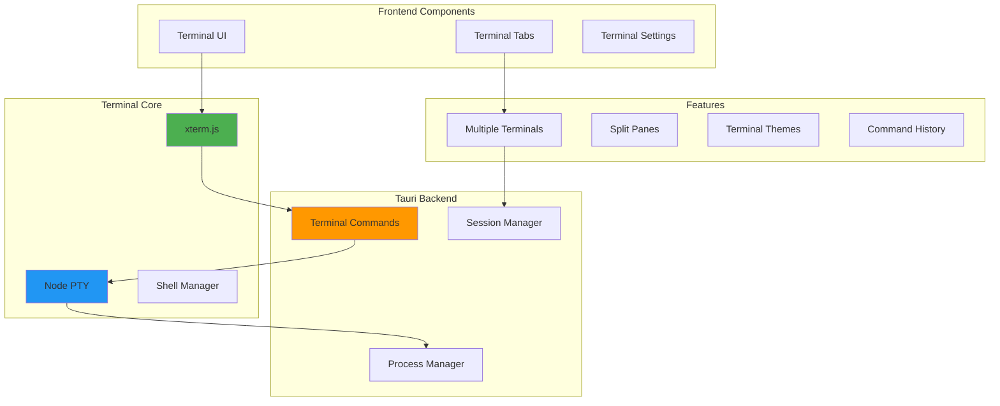
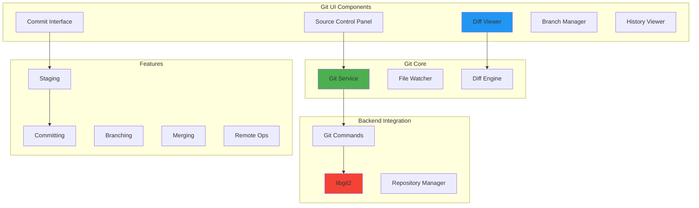

# Terminal and Git Integration Plan

## Overview

This document outlines the implementation plan for integrating terminal functionality and Git operations into Code Pilot Studio v2. These features are part of Phase 4: Advanced Features.

## Terminal Integration

### Architecture Overview



### Implementation Tasks

#### 1. Terminal Core Setup
```typescript
// packages/types/src/terminal.ts
export interface Terminal {
  id: string;
  title: string;
  shell: string;
  cwd: string;
  pid: number;
  isActive: boolean;
  buffer: string[];
}

export interface TerminalSettings {
  defaultShell: string;
  fontSize: number;
  fontFamily: string;
  theme: TerminalTheme;
  scrollback: number;
  cursorStyle: 'block' | 'underline' | 'bar';
}

export interface TerminalCommand {
  type: 'input' | 'resize' | 'clear' | 'kill';
  data: any;
}
```

#### 2. Backend Implementation (Rust)
```rust
// src-tauri/src/terminal/mod.rs
use portable_pty::{CommandBuilder, PtySize, native_pty_system};
use std::sync::{Arc, Mutex};
use std::collections::HashMap;

pub struct TerminalManager {
    terminals: Arc<Mutex<HashMap<String, TerminalSession>>>,
}

pub struct TerminalSession {
    id: String,
    pty: Box<dyn portable_pty::MasterPty>,
    child: Box<dyn portable_pty::Child>,
    reader: Box<dyn std::io::Read>,
    writer: Box<dyn std::io::Write>,
}

#[tauri::command]
pub async fn create_terminal(
    shell: Option<String>,
    cwd: Option<String>,
) -> Result<Terminal, String> {
    // Implementation
}

#[tauri::command]
pub async fn write_to_terminal(
    terminal_id: String,
    data: String,
) -> Result<(), String> {
    // Implementation
}

#[tauri::command]
pub async fn resize_terminal(
    terminal_id: String,
    cols: u16,
    rows: u16,
) -> Result<(), String> {
    // Implementation
}
```

#### 3. Frontend Components
```tsx
// packages/ui/src/components/Terminal/Terminal.tsx
import { Terminal as XTerm } from 'xterm';
import { FitAddon } from 'xterm-addon-fit';
import { WebLinksAddon } from 'xterm-addon-web-links';
import { SearchAddon } from 'xterm-addon-search';

export const Terminal: React.FC<TerminalProps> = ({
  terminalId,
  onData,
  onResize,
}) => {
  const terminalRef = useRef<HTMLDivElement>(null);
  const xtermRef = useRef<XTerm>();
  
  useEffect(() => {
    const terminal = new XTerm({
      theme: getTerminalTheme(),
      fontSize: 14,
      fontFamily: 'Consolas, "Courier New", monospace',
      cursorBlink: true,
    });
    
    // Add addons
    const fitAddon = new FitAddon();
    const webLinksAddon = new WebLinksAddon();
    const searchAddon = new SearchAddon();
    
    terminal.loadAddon(fitAddon);
    terminal.loadAddon(webLinksAddon);
    terminal.loadAddon(searchAddon);
    
    // Set up event handlers
    terminal.onData((data) => {
      onData(terminalId, data);
    });
    
    terminal.onResize(({ cols, rows }) => {
      onResize(terminalId, cols, rows);
    });
    
    return () => {
      terminal.dispose();
    };
  }, [terminalId]);
  
  return <div ref={terminalRef} className="terminal-container" />;
};
```

### Terminal Features Implementation

#### 1. Multiple Terminal Sessions
- Tab management for terminals
- Quick terminal switching (Ctrl+`)
- Terminal naming and renaming
- Session persistence

#### 2. Split Pane Support
```typescript
interface TerminalLayout {
  type: 'single' | 'vertical' | 'horizontal' | 'grid';
  terminals: TerminalPane[];
}

interface TerminalPane {
  id: string;
  terminalId: string;
  size: number; // percentage
  children?: TerminalPane[];
}
```

#### 3. Shell Integration
- Detect available shells (bash, zsh, fish, PowerShell, cmd)
- Custom shell profiles
- Environment variable management
- Working directory synchronization

#### 4. Advanced Features
- Command history search
- Terminal themes (matching editor themes)
- Copy/paste with proper formatting
- Find in terminal
- Clear terminal buffer
- Terminal zoom

## Git Integration

### Architecture Overview



### Implementation Tasks

#### 1. Git Types and Interfaces
```typescript
// packages/types/src/git.ts
export interface GitRepository {
  id: string;
  path: string;
  currentBranch: string;
  remotes: GitRemote[];
  status: GitStatus;
}

export interface GitStatus {
  branch: string;
  ahead: number;
  behind: number;
  staged: GitFileChange[];
  unstaged: GitFileChange[];
  untracked: string[];
}

export interface GitFileChange {
  path: string;
  status: 'added' | 'modified' | 'deleted' | 'renamed' | 'copied';
  oldPath?: string; // for renames
}

export interface GitCommit {
  hash: string;
  author: GitAuthor;
  message: string;
  timestamp: Date;
  parents: string[];
}

export interface GitBranch {
  name: string;
  isRemote: boolean;
  isCurrent: boolean;
  upstream?: string;
  lastCommit: string;
}
```

#### 2. Backend Git Implementation (Rust)
```rust
// src-tauri/src/git/mod.rs
use git2::{Repository, Status, StatusOptions};
use serde::{Deserialize, Serialize};

#[derive(Debug, Serialize, Deserialize)]
pub struct GitRepository {
    pub path: String,
    pub current_branch: String,
    pub status: GitStatus,
}

#[tauri::command]
pub async fn git_status(repo_path: String) -> Result<GitStatus, String> {
    let repo = Repository::open(&repo_path)
        .map_err(|e| format!("Failed to open repository: {}", e))?;
    
    // Get current branch
    let head = repo.head()
        .map_err(|e| format!("Failed to get HEAD: {}", e))?;
    
    let branch = head.shorthand()
        .unwrap_or("HEAD")
        .to_string();
    
    // Get status
    let mut status_options = StatusOptions::new();
    status_options.include_untracked(true);
    
    let statuses = repo.statuses(Some(&mut status_options))
        .map_err(|e| format!("Failed to get status: {}", e))?;
    
    // Process status entries
    let mut staged = Vec::new();
    let mut unstaged = Vec::new();
    let mut untracked = Vec::new();
    
    for entry in statuses.iter() {
        let status = entry.status();
        let path = entry.path().unwrap_or("").to_string();
        
        if status.contains(Status::INDEX_NEW) ||
           status.contains(Status::INDEX_MODIFIED) ||
           status.contains(Status::INDEX_DELETED) {
            staged.push(create_file_change(path.clone(), status));
        }
        
        if status.contains(Status::WT_MODIFIED) ||
           status.contains(Status::WT_DELETED) {
            unstaged.push(create_file_change(path.clone(), status));
        }
        
        if status.contains(Status::WT_NEW) {
            untracked.push(path);
        }
    }
    
    Ok(GitStatus {
        branch,
        staged,
        unstaged,
        untracked,
        ahead: 0, // TODO: Calculate
        behind: 0, // TODO: Calculate
    })
}

#[tauri::command]
pub async fn git_stage_file(repo_path: String, file_path: String) -> Result<(), String> {
    // Implementation
}

#[tauri::command]
pub async fn git_unstage_file(repo_path: String, file_path: String) -> Result<(), String> {
    // Implementation
}

#[tauri::command]
pub async fn git_commit(
    repo_path: String,
    message: String,
    author: GitAuthor,
) -> Result<String, String> {
    // Implementation
}

#[tauri::command]
pub async fn git_diff(
    repo_path: String,
    file_path: String,
    cached: bool,
) -> Result<String, String> {
    // Implementation
}
```

#### 3. Git UI Components

##### Source Control Panel
```tsx
// packages/ui/src/components/Git/SourceControl.tsx
export const SourceControl: React.FC = () => {
  const [status, setStatus] = useState<GitStatus | null>(null);
  const [selectedFiles, setSelectedFiles] = useState<string[]>([]);
  
  return (
    <div className="source-control">
      <div className="source-control-header">
        <BranchSelector />
        <div className="actions">
          <Button icon={<RefreshCw />} onClick={refresh} />
          <Button icon={<GitCommit />} onClick={openCommit} />
          <Button icon={<GitPullRequest />} onClick={openPull} />
        </div>
      </div>
      
      <div className="changes">
        <ChangesList
          title="Staged Changes"
          changes={status?.staged || []}
          onUnstage={handleUnstage}
        />
        
        <ChangesList
          title="Changes"
          changes={status?.unstaged || []}
          onStage={handleStage}
        />
        
        <FileList
          title="Untracked Files"
          files={status?.untracked || []}
          onAdd={handleAdd}
        />
      </div>
    </div>
  );
};
```

##### Diff Viewer
```tsx
// packages/ui/src/components/Git/DiffViewer.tsx
import { DiffEditor } from '@monaco-editor/react';

export const DiffViewer: React.FC<DiffViewerProps> = ({
  original,
  modified,
  path,
}) => {
  return (
    <div className="diff-viewer">
      <div className="diff-header">
        <span className="file-path">{path}</span>
        <div className="diff-actions">
          <Button icon={<Revert />} onClick={revertChanges} />
          <Button icon={<Stage />} onClick={stageChanges} />
        </div>
      </div>
      
      <DiffEditor
        original={original}
        modified={modified}
        language={getLanguageFromPath(path)}
        options={{
          readOnly: true,
          renderSideBySide: true,
        }}
      />
    </div>
  );
};
```

### Git Features Implementation

#### 1. Basic Git Operations
- [x] Status tracking
- [x] Stage/unstage files
- [x] Commit with message
- [x] View diffs (staged/unstaged)
- [ ] Discard changes
- [ ] Stash changes

#### 2. Branch Management
- [ ] List branches (local/remote)
- [ ] Create new branch
- [ ] Switch branches
- [ ] Delete branches
- [ ] Merge branches
- [ ] Rebase support

#### 3. Remote Operations
- [ ] Fetch from remote
- [ ] Pull changes
- [ ] Push commits
- [ ] Add/remove remotes
- [ ] Push to new branch

#### 4. History & Visualization
- [ ] Commit history view
- [ ] Graph visualization
- [ ] Commit details
- [ ] File history
- [ ] Blame view

#### 5. Advanced Features
- [ ] Interactive rebase
- [ ] Cherry-pick commits
- [ ] Resolve merge conflicts
- [ ] Git flow support
- [ ] Submodule management

## Integration Timeline

### Week 1: Terminal Foundation
- Day 1-2: Set up xterm.js and basic terminal UI
- Day 3-4: Implement Rust PTY backend
- Day 5: Connect frontend to backend, basic I/O

### Week 2: Terminal Features
- Day 1-2: Multiple terminal sessions
- Day 3-4: Terminal settings and themes
- Day 5: Shell detection and profiles

### Week 3: Git Foundation
- Day 1-2: Set up libgit2 in Rust backend
- Day 3-4: Implement basic git commands
- Day 5: Create source control UI panel

### Week 4: Git Features
- Day 1-2: Diff viewer implementation
- Day 3-4: Commit interface and staging
- Day 5: Branch management UI

## Testing Strategy

### Terminal Testing
1. Unit tests for terminal commands
2. Integration tests for PTY communication
3. E2E tests for terminal UI interactions
4. Performance tests for large outputs

### Git Testing
1. Unit tests for git operations
2. Integration tests with test repositories
3. UI tests for git workflows
4. Edge case testing (conflicts, large repos)

## Performance Considerations

### Terminal Performance
- Virtual scrolling for large outputs
- Debounced resize events
- Efficient buffer management
- Web worker for heavy processing

### Git Performance
- Lazy loading for large repositories
- Incremental status updates
- Cached diff computations
- Background indexing

## Security Considerations

### Terminal Security
- Sanitize shell commands
- Restrict file system access
- Environment variable filtering
- Process isolation

### Git Security
- Credential management
- SSH key handling
- GPG signing support
- Protected branch restrictions

## Dependencies

### Terminal Dependencies
- Frontend: xterm.js, xterm-addon-*
- Backend: portable-pty, tokio

### Git Dependencies
- Frontend: monaco-editor (diff viewer)
- Backend: git2-rs (libgit2 bindings)

## Success Criteria

### Terminal Success Metrics
- [ ] < 50ms input latency
- [ ] Support for major shells
- [ ] Smooth resize handling
- [ ] Proper Unicode support

### Git Success Metrics
- [ ] < 100ms status refresh
- [ ] Accurate diff display
- [ ] Reliable commit operations
- [ ] Clear conflict resolution

## Next Steps

1. **Prototype Terminal Integration**
   - Create basic terminal component
   - Test PTY communication
   - Implement resize handling

2. **Prototype Git Integration**
   - Set up libgit2
   - Create status command
   - Build simple UI

3. **User Testing**
   - Gather feedback on workflows
   - Identify missing features
   - Refine UI/UX

4. **Production Implementation**
   - Complete all features
   - Optimize performance
   - Add comprehensive tests