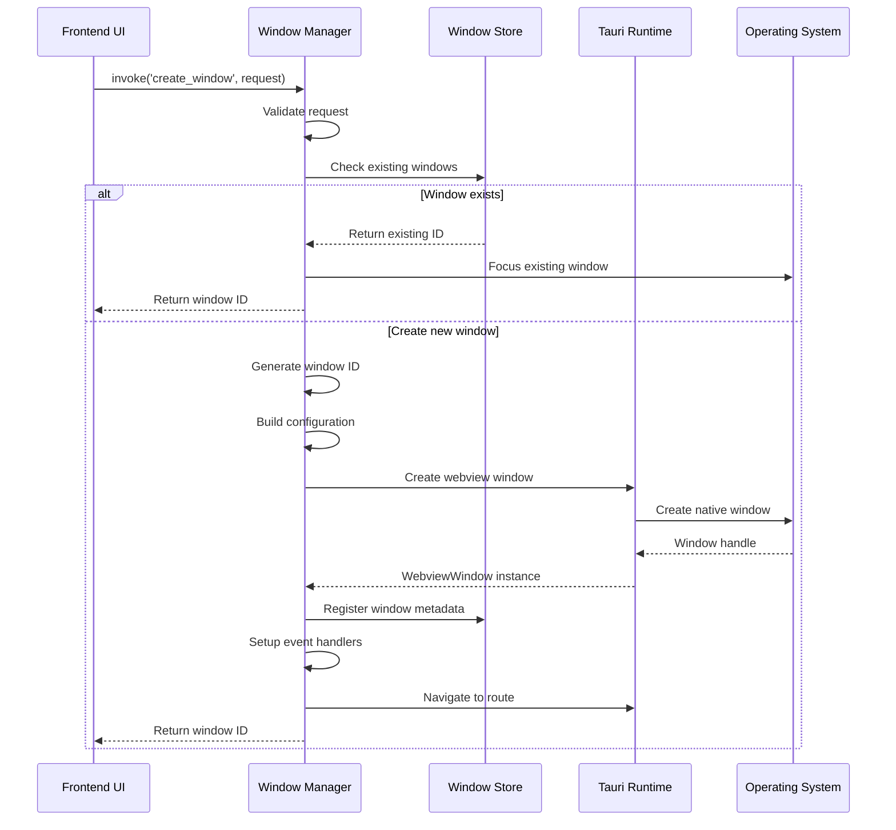
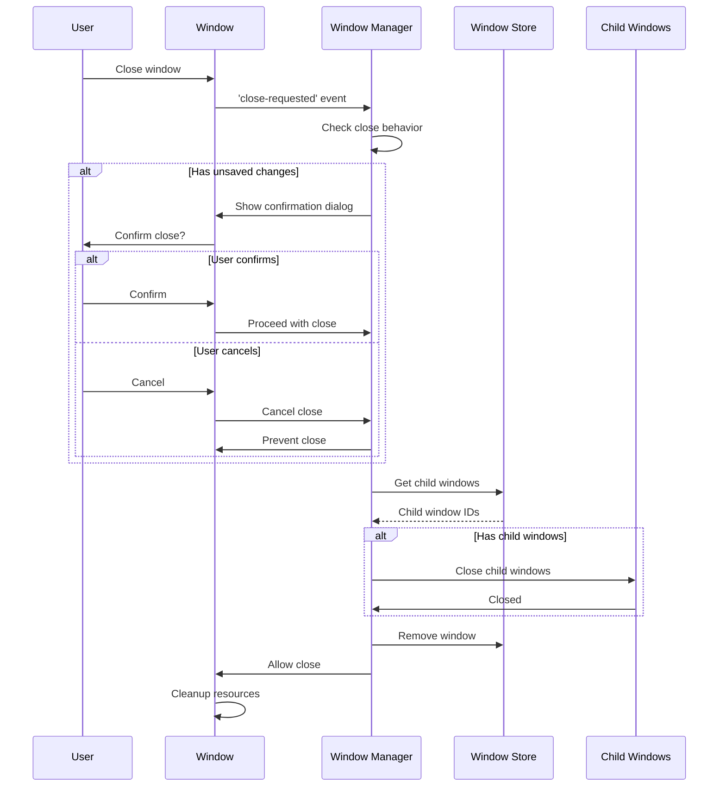

# Window Management System - Detailed Technical Specification

## Table of Contents

1. [Executive Summary](#executive-summary)
2. [System Architecture](#system-architecture)
3. [Plugin Implementation](#plugin-implementation)
4. [Window Lifecycle Management](#window-lifecycle-management)
5. [Frontend Integration](#frontend-integration)
6. [State Management](#state-management)
7. [Inter-Window Communication](#inter-window-communication)
8. [Security Model](#security-model)
9. [Performance Optimization](#performance-optimization)
10. [Testing Strategy](#testing-strategy)
11. [Migration Guide](#migration-guide)
12. [API Reference](#api-reference)

## Executive Summary

The Window Management System for Code Pilot Studio v2 provides a robust, multi-window desktop application experience. This system allows users to open projects, Claude sessions, terminals, and other features in separate native OS windows, providing flexibility and improved workflow management.

### Core Principles

1. **Modularity**: Complete separation of window management from business logic
2. **Type Safety**: Full TypeScript support with comprehensive type definitions
3. **Performance**: Efficient resource management and lazy loading
4. **Security**: Sandboxed windows with controlled communication channels
5. **User Experience**: Consistent behavior across all window types

## System Architecture

### High-Level Overview

```
┌─────────────────────────────────────────────────────────────┐
│                        Main Process                         │
├─────────────────────────────────────────────────────────────┤
│  ┌─────────────────┐  ┌──────────────┐  ┌───────────────┐ │
│  │ Window Manager  │  │ State Store  │  │ Event System  │ │
│  │    Plugin       │  │              │  │               │ │
│  └────────┬────────┘  └──────┬───────┘  └───────┬───────┘ │
│           │                   │                   │         │
│  ┌────────┴──────────────────┴───────────────────┴───────┐ │
│  │                    IPC Bridge                          │ │
│  └────────────────────────────────────────────────────────┘ │
└─────────────────────────────────────────────────────────────┘
                              │
┌─────────────────────────────┼─────────────────────────────┐
│                          Renderer                          │
├─────────────────────────────┴─────────────────────────────┤
│  ┌─────────────┐  ┌─────────────┐  ┌─────────────┐      │
│  │   Main      │  │   Project   │  │   Session   │  ...  │
│  │   Window    │  │   Window    │  │   Window    │       │
│  └─────────────┘  └─────────────┘  └─────────────┘      │
└───────────────────────────────────────────────────────────┘
```

### Component Breakdown

#### 1. Window Manager Plugin (Rust)
- Handles window creation, destruction, and lifecycle
- Maintains window registry
- Manages window templates and configurations
- Provides IPC commands for window operations

#### 2. State Store
- Centralized state management for window metadata
- Tracks window relationships and dependencies
- Handles state persistence and recovery

#### 3. Event System
- Facilitates inter-window communication
- Manages window lifecycle events
- Handles system-level window events

#### 4. Frontend Windows
- Individual Tauri windows with React applications
- Window-specific routing and components
- Shared component library usage

## Plugin Implementation

### Directory Structure

```
plugins/tauri-plugin-window-manager/
├── Cargo.toml
├── build.rs
├── package.json
├── src/
│   ├── lib.rs                      # Plugin entry point
│   ├── commands.rs                 # Tauri command handlers
│   ├── window_manager.rs           # Core window management logic
│   ├── models.rs                   # Data structures and types
│   ├── window_store.rs             # Window state management
│   ├── window_factory.rs           # Window creation factory
│   ├── event_system.rs             # Event handling
│   ├── config.rs                   # Configuration management
│   └── error.rs                    # Error types
├── permissions/
│   ├── autogenerated/
│   └── schemas/
│       ├── create-window.json
│       ├── close-window.json
│       └── window-communication.json
└── guest-js/
    ├── index.ts                    # Public API
    ├── window-manager.ts           # Window management client
    ├── types.ts                    # TypeScript definitions
    └── events.ts                   # Event system client
```

### Core Components

#### 1. Window Manager (window_manager.rs)

```rust
use std::sync::{Arc, Mutex};
use std::collections::HashMap;
use tauri::{AppHandle, Manager, Runtime, WebviewWindow};
use uuid::Uuid;

pub struct WindowManager<R: Runtime> {
    app: AppHandle<R>,
    windows: Arc<Mutex<HashMap<WindowId, WindowMetadata>>>,
    templates: Arc<Mutex<HashMap<String, WindowTemplate>>>,
    config: WindowConfig,
}

impl<R: Runtime> WindowManager<R> {
    pub fn new(app: AppHandle<R>) -> Self {
        let mut templates = HashMap::new();
        
        // Initialize default templates
        templates.insert("project".to_string(), WindowTemplate {
            width: 1400,
            height: 900,
            decorations: true,
            transparent: false,
            always_on_top: false,
            resizable: true,
            fullscreen: false,
            center: true,
            title_template: "Code Pilot - {name}",
            min_width: Some(800),
            min_height: Some(600),
        });
        
        templates.insert("session".to_string(), WindowTemplate {
            width: 800,
            height: 900,
            decorations: true,
            transparent: false,
            always_on_top: false,
            resizable: true,
            fullscreen: false,
            center: false,
            title_template: "Claude Session - {name}",
            min_width: Some(600),
            min_height: Some(400),
        });
        
        Self {
            app,
            windows: Arc::new(Mutex::new(HashMap::new())),
            templates: Arc::new(Mutex::new(templates)),
            config: WindowConfig::default(),
        }
    }
    
    pub async fn create_window(&self, request: CreateWindowRequest) -> Result<WindowId> {
        // Validate request
        self.validate_request(&request)?;
        
        // Check for existing window
        if let Some(existing_id) = self.find_existing_window(&request)? {
            self.focus_window(existing_id)?;
            return Ok(existing_id);
        }
        
        // Generate unique window ID
        let window_id = self.generate_window_id(&request);
        
        // Get template
        let template = self.get_template(&request.window_type)?;
        
        // Create window configuration
        let window_config = self.build_window_config(&request, &template)?;
        
        // Create the window
        let window = self.create_tauri_window(&window_id, &window_config)?;
        
        // Register window
        self.register_window(window_id.clone(), WindowMetadata {
            id: window_id.clone(),
            window_type: request.window_type.clone(),
            created_at: chrono::Utc::now(),
            parent_id: request.parent_id.clone(),
            state: WindowState::Active,
            config: window_config,
            custom_data: request.custom_data.clone(),
        })?;
        
        // Set up event handlers
        self.setup_window_events(&window)?;
        
        // Navigate to appropriate route
        self.navigate_window(&window, &request)?;
        
        Ok(window_id)
    }
}
```

#### 2. Window Models (models.rs)

```rust
use serde::{Deserialize, Serialize};
use std::collections::HashMap;

#[derive(Debug, Clone, Serialize, Deserialize)]
pub struct WindowId(pub String);

#[derive(Debug, Clone, Serialize, Deserialize)]
#[serde(tag = "type")]
pub enum WindowType {
    Main,
    Project { 
        path: String,
        workspace_id: Option<String>,
    },
    Session { 
        session_id: String,
        detached: bool,
    },
    Terminal { 
        terminal_id: String,
        working_directory: Option<String>,
    },
    GitDiff { 
        repo_path: String,
        from_commit: Option<String>,
        to_commit: Option<String>,
    },
    Settings {
        initial_tab: Option<String>,
    },
    Custom {
        type_name: String,
        data: HashMap<String, serde_json::Value>,
    },
}

#[derive(Debug, Clone, Serialize, Deserialize)]
pub struct WindowMetadata {
    pub id: WindowId,
    pub window_type: WindowType,
    pub created_at: chrono::DateTime<chrono::Utc>,
    pub parent_id: Option<WindowId>,
    pub state: WindowState,
    pub config: WindowConfig,
    pub custom_data: Option<HashMap<String, serde_json::Value>>,
}

#[derive(Debug, Clone, Serialize, Deserialize)]
pub enum WindowState {
    Active,
    Minimized,
    Maximized,
    Fullscreen,
    Hidden,
    Closing,
}

#[derive(Debug, Clone, Serialize, Deserialize)]
pub struct WindowTemplate {
    pub width: u32,
    pub height: u32,
    pub decorations: bool,
    pub transparent: bool,
    pub always_on_top: bool,
    pub resizable: bool,
    pub fullscreen: bool,
    pub center: bool,
    pub title_template: String,
    pub min_width: Option<u32>,
    pub min_height: Option<u32>,
    pub max_width: Option<u32>,
    pub max_height: Option<u32>,
    pub x: Option<i32>,
    pub y: Option<i32>,
}

#[derive(Debug, Clone, Serialize, Deserialize)]
pub struct CreateWindowRequest {
    pub window_type: WindowType,
    pub parent_id: Option<WindowId>,
    pub config_overrides: Option<WindowConfigOverrides>,
    pub custom_data: Option<HashMap<String, serde_json::Value>>,
    pub focus: bool,
}
```

#### 3. Window Store (window_store.rs)

```rust
use std::sync::{Arc, RwLock};
use std::collections::{HashMap, HashSet};

pub struct WindowStore {
    windows: Arc<RwLock<HashMap<WindowId, WindowMetadata>>>,
    type_index: Arc<RwLock<HashMap<String, HashSet<WindowId>>>>,
    parent_index: Arc<RwLock<HashMap<WindowId, HashSet<WindowId>>>>,
}

impl WindowStore {
    pub fn new() -> Self {
        Self {
            windows: Arc::new(RwLock::new(HashMap::new())),
            type_index: Arc::new(RwLock::new(HashMap::new())),
            parent_index: Arc::new(RwLock::new(HashMap::new())),
        }
    }
    
    pub fn add_window(&self, metadata: WindowMetadata) -> Result<()> {
        let window_id = metadata.id.clone();
        let window_type = format!("{:?}", metadata.window_type);
        let parent_id = metadata.parent_id.clone();
        
        // Add to main store
        self.windows.write()?.insert(window_id.clone(), metadata);
        
        // Update type index
        self.type_index
            .write()?
            .entry(window_type)
            .or_insert_with(HashSet::new)
            .insert(window_id.clone());
        
        // Update parent index
        if let Some(parent) = parent_id {
            self.parent_index
                .write()?
                .entry(parent)
                .or_insert_with(HashSet::new)
                .insert(window_id);
        }
        
        Ok(())
    }
    
    pub fn remove_window(&self, window_id: &WindowId) -> Result<Option<WindowMetadata>> {
        // Remove from main store
        let metadata = self.windows.write()?.remove(window_id);
        
        if let Some(ref meta) = metadata {
            // Remove from type index
            let window_type = format!("{:?}", meta.window_type);
            if let Some(set) = self.type_index.write()?.get_mut(&window_type) {
                set.remove(window_id);
            }
            
            // Remove from parent index
            if let Some(ref parent_id) = meta.parent_id {
                if let Some(set) = self.parent_index.write()?.get_mut(parent_id) {
                    set.remove(window_id);
                }
            }
            
            // Handle orphaned children
            if let Some(children) = self.parent_index.write()?.remove(window_id) {
                // Optionally close children or reparent them
                for child_id in children {
                    self.handle_orphaned_window(&child_id)?;
                }
            }
        }
        
        Ok(metadata)
    }
    
    pub fn find_windows_by_type(&self, window_type: &str) -> Result<Vec<WindowId>> {
        Ok(self.type_index
            .read()?
            .get(window_type)
            .map(|set| set.iter().cloned().collect())
            .unwrap_or_default())
    }
}
```

## Window Lifecycle Management

### Window Creation Flow



### Window Destruction Flow



### Window State Transitions

```
┌─────────┐     minimize      ┌────────────┐
│ Active  │ ─────────────────▶ │ Minimized  │
│         │ ◀───────────────── │            │
└─────────┘     restore        └────────────┘
     │                               ▲
     │ maximize                      │
     ▼                               │
┌─────────┐                          │
│Maximized│ ─────────────────────────┘
│         │      minimize
└─────────┘
     │
     │ fullscreen
     ▼
┌──────────┐     exit fullscreen  ┌─────────┐
│Fullscreen│ ────────────────────▶│ Active  │
│          │                       │         │
└──────────┘                       └─────────┘
     │
     │ close
     ▼
┌─────────┐     cleanup complete  ┌─────────┐
│ Closing │ ─────────────────────▶│ Closed  │
│         │                        │         │
└─────────┘                        └─────────┘
```

## Frontend Integration

### Window Context Provider

```typescript
// src/contexts/WindowContext.tsx
import React, { createContext, useContext, useEffect, useState } from 'react';
import { invoke } from '@tauri-apps/api/core';
import { listen } from '@tauri-apps/api/event';
import { WindowManager } from '@/lib/window-manager';

interface WindowContextValue {
  windowId: string;
  windowType: WindowType;
  windowMetadata: WindowMetadata;
  parentWindow?: string;
  isMainWindow: boolean;
  windowManager: WindowManager;
  
  // Actions
  createWindow: (request: CreateWindowRequest) => Promise<string>;
  closeWindow: (windowId?: string) => Promise<void>;
  focusWindow: (windowId: string) => Promise<void>;
  minimizeWindow: (windowId?: string) => Promise<void>;
  maximizeWindow: (windowId?: string) => Promise<void>;
  
  // State
  childWindows: WindowMetadata[];
  siblingWindows: WindowMetadata[];
}

const WindowContext = createContext<WindowContextValue | null>(null);

export function WindowProvider({ children }: { children: React.ReactNode }) {
  const [windowMetadata, setWindowMetadata] = useState<WindowMetadata | null>(null);
  const [childWindows, setChildWindows] = useState<WindowMetadata[]>([]);
  const windowManager = WindowManager.getInstance();
  
  useEffect(() => {
    // Get current window metadata
    async function initializeWindow() {
      const metadata = await windowManager.getCurrentWindowMetadata();
      setWindowMetadata(metadata);
    }
    
    initializeWindow();
    
    // Listen for window events
    const unlistenWindowUpdate = listen('window-metadata-updated', (event) => {
      if (event.payload.windowId === windowMetadata?.id) {
        setWindowMetadata(event.payload.metadata);
      }
    });
    
    const unlistenChildUpdate = listen('child-windows-updated', (event) => {
      if (event.payload.parentId === windowMetadata?.id) {
        setChildWindows(event.payload.children);
      }
    });
    
    return () => {
      unlistenWindowUpdate.then(fn => fn());
      unlistenChildUpdate.then(fn => fn());
    };
  }, []);
  
  const createWindow = async (request: CreateWindowRequest) => {
    // Set parent ID to current window if not specified
    if (!request.parent_id && !windowMetadata?.isMainWindow) {
      request.parent_id = windowMetadata?.id;
    }
    
    return await windowManager.createWindow(request);
  };
  
  const value: WindowContextValue = {
    windowId: windowMetadata?.id || '',
    windowType: windowMetadata?.windowType || WindowType.Main,
    windowMetadata: windowMetadata!,
    parentWindow: windowMetadata?.parentId,
    isMainWindow: windowMetadata?.windowType === WindowType.Main,
    windowManager,
    createWindow,
    closeWindow: windowManager.closeWindow,
    focusWindow: windowManager.focusWindow,
    minimizeWindow: windowManager.minimizeWindow,
    maximizeWindow: windowManager.maximizeWindow,
    childWindows,
    siblingWindows: [], // Implement sibling logic
  };
  
  return (
    <WindowContext.Provider value={value}>
      {windowMetadata ? children : <WindowLoader />}
    </WindowContext.Provider>
  );
}

export const useWindow = () => {
  const context = useContext(WindowContext);
  if (!context) {
    throw new Error('useWindow must be used within WindowProvider');
  }
  return context;
};
```

### Window Manager Client

```typescript
// src/lib/window-manager.ts
import { invoke } from '@tauri-apps/api/core';
import { emit, listen } from '@tauri-apps/api/event';
import { WebviewWindow } from '@tauri-apps/api/webviewWindow';

export class WindowManager {
  private static instance: WindowManager;
  private windows: Map<string, WindowMetadata> = new Map();
  private eventUnlisteners: Array<() => void> = [];
  
  private constructor() {
    this.initializeEventListeners();
  }
  
  static getInstance(): WindowManager {
    if (!WindowManager.instance) {
      WindowManager.instance = new WindowManager();
    }
    return WindowManager.instance;
  }
  
  private async initializeEventListeners() {
    // Listen for window lifecycle events
    const events = [
      'window-created',
      'window-closed',
      'window-focused',
      'window-blurred',
      'window-state-changed',
    ];
    
    for (const eventName of events) {
      const unlisten = await listen(eventName, (event) => {
        this.handleWindowEvent(eventName, event.payload);
      });
      this.eventUnlisteners.push(unlisten);
    }
    
    // Load initial window list
    await this.refreshWindowList();
  }
  
  async createWindow(request: CreateWindowRequest): Promise<string> {
    try {
      const windowId = await invoke<string>('plugin:window-manager|create_window', {
        request
      });
      
      // Wait for window to be ready
      await this.waitForWindow(windowId);
      
      return windowId;
    } catch (error) {
      console.error('Failed to create window:', error);
      throw error;
    }
  }
  
  async closeWindow(windowId?: string): Promise<void> {
    const targetId = windowId || await this.getCurrentWindowId();
    
    // Check for unsaved changes
    const hasUnsavedChanges = await this.checkUnsavedChanges(targetId);
    if (hasUnsavedChanges) {
      const confirmed = await this.confirmClose();
      if (!confirmed) return;
    }
    
    await invoke('plugin:window-manager|close_window', {
      windowId: targetId
    });
  }
  
  async sendMessageToWindow(windowId: string, message: WindowMessage): Promise<void> {
    await emit(`window-message-${windowId}`, message);
  }
  
  async broadcastMessage(message: WindowMessage): Promise<void> {
    const windows = await this.getAllWindows();
    for (const window of windows) {
      await this.sendMessageToWindow(window.id, message);
    }
  }
  
  private async waitForWindow(windowId: string, timeout = 5000): Promise<void> {
    return new Promise((resolve, reject) => {
      const startTime = Date.now();
      
      const checkWindow = async () => {
        const window = await this.getWindow(windowId);
        if (window && window.state === WindowState.Active) {
          resolve();
          return;
        }
        
        if (Date.now() - startTime > timeout) {
          reject(new Error(`Window ${windowId} creation timeout`));
          return;
        }
        
        setTimeout(checkWindow, 100);
      };
      
      checkWindow();
    });
  }
}
```

### Window-Specific Components

#### Project Window Component

```typescript
// src/windows/ProjectWindow.tsx
import React, { useEffect, useState } from 'react';
import { useParams } from 'react-router-dom';
import { useWindow } from '@/contexts/WindowContext';
import { FileExplorer } from '@/components/FileExplorer';
import { CodeEditor } from '@/components/CodeEditor';
import { Terminal } from '@/components/Terminal';
import { GitPanel } from '@/components/GitPanel';

export function ProjectWindow() {
  const { encodedPath } = useParams();
  const projectPath = decodeURIComponent(encodedPath || '');
  const { windowMetadata, createWindow } = useWindow();
  const [activeFile, setActiveFile] = useState<string | null>(null);
  
  useEffect(() => {
    // Set window title
    document.title = `Code Pilot - ${projectPath.split('/').pop()}`;
    
    // Initialize project-specific services
    initializeProjectServices(projectPath);
    
    return () => {
      // Cleanup project services
      cleanupProjectServices();
    };
  }, [projectPath]);
  
  const handleOpenTerminal = async () => {
    await createWindow({
      window_type: {
        type: 'Terminal',
        terminal_id: crypto.randomUUID(),
        working_directory: projectPath
      },
      config_overrides: {
        width: 800,
        height: 600,
        title: `Terminal - ${projectPath.split('/').pop()}`
      }
    });
  };
  
  return (
    <div className="flex h-screen bg-background">
      <aside className="w-64 border-r">
        <FileExplorer
          rootPath={projectPath}
          onFileSelect={setActiveFile}
        />
      </aside>
      
      <div className="flex-1 flex flex-col">
        <header className="border-b p-2 flex items-center justify-between">
          <h1 className="text-sm font-medium">{projectPath}</h1>
          <div className="flex gap-2">
            <button onClick={handleOpenTerminal}>
              Open Terminal
            </button>
          </div>
        </header>
        
        <main className="flex-1 flex">
          <div className="flex-1">
            {activeFile && (
              <CodeEditor
                filePath={activeFile}
                projectPath={projectPath}
              />
            )}
          </div>
          
          <aside className="w-80 border-l">
            <GitPanel projectPath={projectPath} />
          </aside>
        </main>
        
        <footer className="border-t">
          <Terminal
            workingDirectory={projectPath}
            embedded={true}
          />
        </footer>
      </div>
    </div>
  );
}
```

## State Management

### Cross-Window State Synchronization

```typescript
// src/lib/cross-window-state.ts
import { BroadcastChannel } from 'broadcast-channel';
import { create } from 'zustand';
import { subscribeWithSelector } from 'zustand/middleware';

interface SharedState {
  theme: 'light' | 'dark';
  openFiles: Map<string, FileState>;
  activeSessions: Map<string, SessionState>;
  globalSettings: GlobalSettings;
}

class CrossWindowStateManager {
  private channel: BroadcastChannel;
  private subscribers: Map<string, (state: any) => void> = new Map();
  
  constructor() {
    this.channel = new BroadcastChannel('code-pilot-state');
    this.setupChannelListener();
  }
  
  private setupChannelListener() {
    this.channel.onmessage = (message) => {
      if (message.type === 'STATE_UPDATE') {
        const { storeName, updates } = message.payload;
        const subscriber = this.subscribers.get(storeName);
        if (subscriber) {
          subscriber(updates);
        }
      }
    };
  }
  
  createSharedStore<T extends object>(
    name: string,
    initialState: T,
    options?: SharedStoreOptions
  ) {
    const store = create<T>()(
      subscribeWithSelector((set, get) => ({
        ...initialState,
        
        // Broadcast state changes
        setState: (updates: Partial<T>) => {
          set(updates);
          
          if (!options?.disableBroadcast) {
            this.channel.postMessage({
              type: 'STATE_UPDATE',
              payload: {
                storeName: name,
                updates,
                windowId: window.__TAURI_METADATA__?.windowLabel
              }
            });
          }
        }
      }))
    );
    
    // Subscribe to remote updates
    this.subscribers.set(name, (updates) => {
      store.setState(updates);
    });
    
    return store;
  }
}

// Usage example
export const useSharedProjectState = CrossWindowStateManager
  .getInstance()
  .createSharedStore('project-state', {
    openFiles: new Map(),
    activeFile: null,
    unsavedChanges: new Set<string>(),
  });
```

### Window-Specific State

```typescript
// src/stores/window-store.ts
import { create } from 'zustand';
import { persist } from 'zustand/middleware';

interface WindowSpecificState {
  layout: WindowLayout;
  splitPanes: PaneConfiguration[];
  toolbarVisible: boolean;
  sidebarCollapsed: boolean;
  terminalHeight: number;
  recentFiles: string[];
}

export const useWindowState = create<WindowSpecificState>()(
  persist(
    (set) => ({
      layout: 'default',
      splitPanes: [],
      toolbarVisible: true,
      sidebarCollapsed: false,
      terminalHeight: 200,
      recentFiles: [],
      
      setLayout: (layout) => set({ layout }),
      toggleSidebar: () => set((state) => ({ 
        sidebarCollapsed: !state.sidebarCollapsed 
      })),
      addRecentFile: (file) => set((state) => ({
        recentFiles: [file, ...state.recentFiles.filter(f => f !== file)].slice(0, 10)
      })),
    }),
    {
      name: `window-state-${window.__TAURI_METADATA__?.windowLabel}`,
      partialize: (state) => ({
        layout: state.layout,
        sidebarCollapsed: state.sidebarCollapsed,
        terminalHeight: state.terminalHeight,
      })
    }
  )
);
```

## Inter-Window Communication

### Message Protocol

```typescript
// src/lib/window-messaging.ts
export enum MessageType {
  // File operations
  FILE_OPENED = 'FILE_OPENED',
  FILE_CLOSED = 'FILE_CLOSED',
  FILE_SAVED = 'FILE_SAVED',
  FILE_CHANGED = 'FILE_CHANGED',
  
  // Project operations
  PROJECT_OPENED = 'PROJECT_OPENED',
  PROJECT_CLOSED = 'PROJECT_CLOSED',
  
  // Session operations
  SESSION_CREATED = 'SESSION_CREATED',
  SESSION_UPDATED = 'SESSION_UPDATED',
  SESSION_CLOSED = 'SESSION_CLOSED',
  
  // Navigation
  NAVIGATE_TO = 'NAVIGATE_TO',
  OPEN_FILE_AT_LINE = 'OPEN_FILE_AT_LINE',
  
  // State sync
  STATE_SYNC_REQUEST = 'STATE_SYNC_REQUEST',
  STATE_SYNC_RESPONSE = 'STATE_SYNC_RESPONSE',
  
  // Commands
  EXECUTE_COMMAND = 'EXECUTE_COMMAND',
  COMMAND_RESULT = 'COMMAND_RESULT',
}

export interface WindowMessage<T = any> {
  id: string;
  type: MessageType;
  source: string;
  target?: string;
  payload: T;
  timestamp: number;
  requiresResponse?: boolean;
}

export class WindowMessenger {
  private pendingResponses: Map<string, {
    resolve: (value: any) => void;
    reject: (error: any) => void;
    timeout: NodeJS.Timeout;
  }> = new Map();
  
  async sendMessage<T, R = void>(
    target: string,
    type: MessageType,
    payload: T,
    requiresResponse = false
  ): Promise<R> {
    const message: WindowMessage<T> = {
      id: crypto.randomUUID(),
      type,
      source: await this.getCurrentWindowId(),
      target,
      payload,
      timestamp: Date.now(),
      requiresResponse,
    };
    
    if (requiresResponse) {
      return new Promise((resolve, reject) => {
        const timeout = setTimeout(() => {
          this.pendingResponses.delete(message.id);
          reject(new Error('Message response timeout'));
        }, 5000);
        
        this.pendingResponses.set(message.id, {
          resolve,
          reject,
          timeout,
        });
        
        this.dispatchMessage(message);
      });
    } else {
      this.dispatchMessage(message);
      return undefined as any;
    }
  }
  
  private async dispatchMessage(message: WindowMessage) {
    await invoke('plugin:window-manager|send_message', { message });
  }
  
  async handleIncomingMessage(message: WindowMessage) {
    // Check if this is a response to a pending request
    if (message.type === MessageType.COMMAND_RESULT) {
      const pending = this.pendingResponses.get(message.payload.requestId);
      if (pending) {
        clearTimeout(pending.timeout);
        pending.resolve(message.payload.result);
        this.pendingResponses.delete(message.payload.requestId);
        return;
      }
    }
    
    // Handle the message based on type
    switch (message.type) {
      case MessageType.FILE_OPENED:
        await this.handleFileOpened(message.payload);
        break;
        
      case MessageType.NAVIGATE_TO:
        await this.handleNavigateTo(message.payload);
        break;
        
      case MessageType.EXECUTE_COMMAND:
        const result = await this.executeCommand(message.payload);
        if (message.requiresResponse) {
          await this.sendResponse(message.source, message.id, result);
        }
        break;
    }
  }
}
```

### Window Communication Examples

```typescript
// Example 1: Opening a file in a specific window
async function openFileInProjectWindow(projectPath: string, filePath: string) {
  const windowManager = WindowManager.getInstance();
  
  // Find or create project window
  const projectWindows = await windowManager.getWindowsByType('Project');
  let targetWindow = projectWindows.find(w => 
    w.metadata.window_type.path === projectPath
  );
  
  if (!targetWindow) {
    const windowId = await windowManager.createWindow({
      window_type: { type: 'Project', path: projectPath },
    });
    targetWindow = await windowManager.getWindow(windowId);
  }
  
  // Send message to open file
  const messenger = new WindowMessenger();
  await messenger.sendMessage(
    targetWindow.id,
    MessageType.OPEN_FILE_AT_LINE,
    { filePath, line: 1, column: 1 }
  );
}

// Example 2: Synchronizing theme across windows
async function changeThemeGlobally(theme: 'light' | 'dark') {
  const messenger = new WindowMessenger();
  const windows = await WindowManager.getInstance().getAllWindows();
  
  // Broadcast theme change to all windows
  await Promise.all(
    windows.map(window => 
      messenger.sendMessage(
        window.id,
        MessageType.EXECUTE_COMMAND,
        { command: 'setTheme', args: { theme } }
      )
    )
  );
}

// Example 3: Coordinating between session and project windows
async function linkSessionToProject(sessionId: string, projectPath: string) {
  const messenger = new WindowMessenger();
  
  // Notify project window about new session
  await messenger.sendMessage(
    projectWindowId,
    MessageType.SESSION_CREATED,
    { sessionId, projectPath }
  );
  
  // Notify session window about project context
  await messenger.sendMessage(
    sessionWindowId,
    MessageType.PROJECT_OPENED,
    { projectPath }
  );
}
```

## Security Model

### Window Isolation

```rust
// Permission system for window operations
pub struct WindowPermissions {
    can_create_windows: bool,
    can_close_other_windows: bool,
    can_send_messages: bool,
    can_receive_messages: bool,
    allowed_window_types: Vec<WindowType>,
    max_windows: Option<usize>,
    max_child_windows: Option<usize>,
}

impl WindowPermissions {
    pub fn validate_create_request(
        &self, 
        request: &CreateWindowRequest,
        current_window_count: usize
    ) -> Result<()> {
        // Check if window creation is allowed
        if !self.can_create_windows {
            return Err(Error::PermissionDenied("Window creation not allowed"));
        }
        
        // Check window type
        if !self.allowed_window_types.contains(&request.window_type) {
            return Err(Error::PermissionDenied("Window type not allowed"));
        }
        
        // Check window limits
        if let Some(max) = self.max_windows {
            if current_window_count >= max {
                return Err(Error::WindowLimitExceeded);
            }
        }
        
        Ok(())
    }
}
```

### Content Security Policy

```typescript
// Window-specific CSP configuration
export const getWindowCSP = (windowType: WindowType): string => {
  const baseCSP = [
    "default-src 'self'",
    "script-src 'self' 'unsafe-inline' 'unsafe-eval'",
    "style-src 'self' 'unsafe-inline'",
    "img-src 'self' data: https:",
    "font-src 'self' data:",
  ];
  
  // Add window-specific policies
  switch (windowType) {
    case WindowType.Project:
      baseCSP.push("connect-src 'self' ws: wss: http://localhost:*");
      break;
      
    case WindowType.Session:
      baseCSP.push("connect-src 'self' https://api.anthropic.com");
      break;
      
    case WindowType.Terminal:
      baseCSP.push("connect-src 'self' ws://localhost:*");
      break;
  }
  
  return baseCSP.join('; ');
};
```

### Message Validation

```rust
#[derive(Debug, Serialize, Deserialize)]
pub struct MessageValidator {
    allowed_types: HashSet<String>,
    max_payload_size: usize,
    rate_limits: HashMap<String, RateLimit>,
}

impl MessageValidator {
    pub fn validate_message(&self, message: &WindowMessage) -> Result<()> {
        // Check message type
        if !self.allowed_types.contains(&message.message_type) {
            return Err(Error::InvalidMessageType);
        }
        
        // Check payload size
        let payload_size = serde_json::to_vec(&message.payload)?.len();
        if payload_size > self.max_payload_size {
            return Err(Error::PayloadTooLarge);
        }
        
        // Check rate limits
        if let Some(limit) = self.rate_limits.get(&message.source) {
            if !limit.check() {
                return Err(Error::RateLimitExceeded);
            }
        }
        
        Ok(())
    }
}
```

## Performance Optimization

### Window Pooling

```rust
pub struct WindowPool {
    available: Arc<Mutex<Vec<PooledWindow>>>,
    in_use: Arc<Mutex<HashMap<WindowId, PooledWindow>>>,
    config: PoolConfig,
}

pub struct PooledWindow {
    window: WebviewWindow,
    created_at: Instant,
    last_used: Instant,
    recycle_count: usize,
}

impl WindowPool {
    pub async fn acquire(&self, window_type: &WindowType) -> Result<WindowId> {
        // Try to get a window from the pool
        if let Some(pooled) = self.get_available_window(window_type).await? {
            return Ok(self.activate_pooled_window(pooled).await?);
        }
        
        // Create new window if pool is empty
        self.create_new_window(window_type).await
    }
    
    pub async fn release(&self, window_id: WindowId) -> Result<()> {
        let pooled = self.in_use.lock().await.remove(&window_id)
            .ok_or(Error::WindowNotFound)?;
        
        // Reset window state
        self.reset_window(&pooled.window).await?;
        
        // Return to pool or destroy if too old
        if pooled.recycle_count < self.config.max_recycles {
            self.available.lock().await.push(pooled);
        } else {
            pooled.window.close()?;
        }
        
        Ok(())
    }
}
```

### Lazy Loading

```typescript
// Lazy load window components
const windowComponents = {
  Main: React.lazy(() => import('./windows/MainWindow')),
  Project: React.lazy(() => import('./windows/ProjectWindow')),
  Session: React.lazy(() => import('./windows/SessionWindow')),
  Terminal: React.lazy(() => import('./windows/TerminalWindow')),
  GitDiff: React.lazy(() => import('./windows/GitDiffWindow')),
};

export function WindowRouter() {
  const { windowType } = useWindow();
  const WindowComponent = windowComponents[windowType] || windowComponents.Main;
  
  return (
    <React.Suspense fallback={<WindowLoader />}>
      <WindowComponent />
    </React.Suspense>
  );
}
```

### Resource Management

```rust
pub struct WindowResourceManager {
    memory_limits: HashMap<WindowType, MemoryLimit>,
    cpu_monitors: Arc<Mutex<HashMap<WindowId, CpuMonitor>>>,
}

impl WindowResourceManager {
    pub async fn monitor_window(&self, window_id: WindowId) -> Result<()> {
        let monitor = CpuMonitor::new(window_id.clone());
        self.cpu_monitors.lock().await.insert(window_id.clone(), monitor);
        
        // Start monitoring loop
        tokio::spawn(async move {
            loop {
                let usage = monitor.get_usage().await;
                if usage > 80.0 {
                    // Throttle window updates
                    monitor.throttle().await;
                }
                
                tokio::time::sleep(Duration::from_secs(5)).await;
            }
        });
        
        Ok(())
    }
}
```

## Testing Strategy

### Unit Tests

```rust
#[cfg(test)]
mod tests {
    use super::*;
    
    #[test]
    fn test_window_id_generation() {
        let manager = WindowManager::new(mock_app_handle());
        let request = CreateWindowRequest {
            window_type: WindowType::Project { 
                path: "/test/project".to_string() 
            },
            ..Default::default()
        };
        
        let id = manager.generate_window_id(&request);
        assert!(id.0.starts_with("project-"));
        assert!(id.0.len() > 8);
    }
    
    #[tokio::test]
    async fn test_duplicate_window_prevention() {
        let manager = WindowManager::new(mock_app_handle());
        let request = CreateWindowRequest {
            window_type: WindowType::Project { 
                path: "/test/project".to_string() 
            },
            ..Default::default()
        };
        
        let id1 = manager.create_window(request.clone()).await.unwrap();
        let id2 = manager.create_window(request).await.unwrap();
        
        assert_eq!(id1, id2);
    }
    
    #[tokio::test]
    async fn test_parent_child_relationship() {
        let manager = WindowManager::new(mock_app_handle());
        
        // Create parent window
        let parent_id = manager.create_window(CreateWindowRequest {
            window_type: WindowType::Main,
            ..Default::default()
        }).await.unwrap();
        
        // Create child window
        let child_id = manager.create_window(CreateWindowRequest {
            window_type: WindowType::Terminal { 
                terminal_id: "test".to_string() 
            },
            parent_id: Some(parent_id.clone()),
            ..Default::default()
        }).await.unwrap();
        
        // Verify relationship
        let children = manager.get_child_windows(&parent_id).await.unwrap();
        assert_eq!(children.len(), 1);
        assert_eq!(children[0].id, child_id);
    }
}
```

### Integration Tests

```typescript
// tests/window-integration.test.ts
import { test, expect } from '@playwright/test';
import { WindowManager } from '../src/lib/window-manager';

test.describe('Window Management Integration', () => {
  test('should create and manage project window', async ({ page }) => {
    const windowManager = new WindowManager();
    
    // Create project window
    const windowId = await windowManager.createWindow({
      window_type: { type: 'Project', path: '/test/project' },
    });
    
    expect(windowId).toBeTruthy();
    
    // Verify window is created
    const windows = await windowManager.getAllWindows();
    const projectWindow = windows.find(w => w.id === windowId);
    expect(projectWindow).toBeDefined();
    expect(projectWindow.windowType.type).toBe('Project');
    
    // Test window communication
    const messenger = new WindowMessenger();
    const response = await messenger.sendMessage(
      windowId,
      MessageType.EXECUTE_COMMAND,
      { command: 'getProjectInfo' },
      true
    );
    
    expect(response).toHaveProperty('projectPath', '/test/project');
  });
  
  test('should handle window lifecycle', async ({ page }) => {
    const windowManager = new WindowManager();
    
    // Create window
    const windowId = await windowManager.createWindow({
      window_type: { type: 'Session', session_id: 'test-session' },
    });
    
    // Monitor state changes
    const stateChanges: WindowState[] = [];
    const unlisten = await listen(`window-state-changed`, (event) => {
      if (event.payload.windowId === windowId) {
        stateChanges.push(event.payload.state);
      }
    });
    
    // Minimize window
    await windowManager.minimizeWindow(windowId);
    await page.waitForTimeout(100);
    
    // Restore window
    await windowManager.restoreWindow(windowId);
    await page.waitForTimeout(100);
    
    // Verify state transitions
    expect(stateChanges).toContain(WindowState.Minimized);
    expect(stateChanges).toContain(WindowState.Active);
    
    unlisten();
  });
});
```

### Performance Tests

```typescript
// tests/window-performance.test.ts
test.describe('Window Performance', () => {
  test('should handle multiple windows efficiently', async () => {
    const windowManager = new WindowManager();
    const createTimes: number[] = [];
    
    // Create 10 windows
    for (let i = 0; i < 10; i++) {
      const start = performance.now();
      await windowManager.createWindow({
        window_type: { 
          type: 'Project', 
          path: `/test/project-${i}` 
        },
      });
      const duration = performance.now() - start;
      createTimes.push(duration);
    }
    
    // Verify performance
    const avgCreateTime = createTimes.reduce((a, b) => a + b) / createTimes.length;
    expect(avgCreateTime).toBeLessThan(200); // 200ms average
    
    // Test memory usage
    const memoryUsage = await windowManager.getMemoryUsage();
    expect(memoryUsage.totalMB).toBeLessThan(500); // 500MB for 10 windows
  });
});
```

## Migration Guide

### From Old Window System

```typescript
// Migration helper
export class WindowMigration {
  static async migrateFromOldSystem() {
    // 1. Detect old window preferences
    const oldPrefs = await loadOldPreferences();
    
    // 2. Map old window types to new
    const windowMappings = {
      'editor-window': WindowType.Project,
      'chat-window': WindowType.Session,
      'terminal-window': WindowType.Terminal,
    };
    
    // 3. Migrate window layouts
    if (oldPrefs.savedLayouts) {
      for (const layout of oldPrefs.savedLayouts) {
        await this.migrateLayout(layout, windowMappings);
      }
    }
    
    // 4. Migrate keyboard shortcuts
    if (oldPrefs.shortcuts) {
      await this.migrateShortcuts(oldPrefs.shortcuts);
    }
  }
  
  private static async migrateLayout(
    oldLayout: OldLayout,
    mappings: Record<string, WindowType>
  ) {
    const newLayout: WindowLayout = {
      id: oldLayout.id,
      name: oldLayout.name,
      windows: oldLayout.windows.map(w => ({
        type: mappings[w.type] || WindowType.Main,
        position: w.position,
        size: w.size,
        state: w.state,
      })),
    };
    
    await saveWindowLayout(newLayout);
  }
}
```

### Gradual Adoption

```typescript
// Feature flag for new window system
export const useNewWindowSystem = () => {
  const [enabled, setEnabled] = useState(false);
  
  useEffect(() => {
    // Check feature flag
    invoke<boolean>('get_feature_flag', { flag: 'new_window_system' })
      .then(setEnabled);
  }, []);
  
  return enabled;
};

// Conditional window creation
export const createWindow = async (options: WindowOptions) => {
  const useNew = useNewWindowSystem();
  
  if (useNew) {
    return WindowManager.getInstance().createWindow(options);
  } else {
    // Fall back to old system
    return LegacyWindowManager.createWindow(options);
  }
};
```

## API Reference

### Rust API

```rust
// Window Manager Commands
#[tauri::command]
async fn create_window(
    app: AppHandle,
    request: CreateWindowRequest,
) -> Result<WindowId>;

#[tauri::command]
async fn close_window(
    app: AppHandle,
    window_id: WindowId,
) -> Result<()>;

#[tauri::command]
async fn get_window(
    app: AppHandle,
    window_id: WindowId,
) -> Result<Option<WindowMetadata>>;

#[tauri::command]
async fn list_windows(
    app: AppHandle,
    filter: Option<WindowFilter>,
) -> Result<Vec<WindowMetadata>>;

#[tauri::command]
async fn focus_window(
    app: AppHandle,
    window_id: WindowId,
) -> Result<()>;

#[tauri::command]
async fn minimize_window(
    app: AppHandle,
    window_id: WindowId,
) -> Result<()>;

#[tauri::command]
async fn maximize_window(
    app: AppHandle,
    window_id: WindowId,
) -> Result<()>;

#[tauri::command]
async fn send_message(
    app: AppHandle,
    message: WindowMessage,
) -> Result<()>;

#[tauri::command]
async fn get_window_bounds(
    app: AppHandle,
    window_id: WindowId,
) -> Result<WindowBounds>;

#[tauri::command]
async fn set_window_bounds(
    app: AppHandle,
    window_id: WindowId,
    bounds: WindowBounds,
) -> Result<()>;
```

### TypeScript API

```typescript
// Window Manager Client API
export interface WindowManager {
  // Window lifecycle
  createWindow(request: CreateWindowRequest): Promise<string>;
  closeWindow(windowId?: string): Promise<void>;
  closeAllWindows(): Promise<void>;
  
  // Window queries
  getWindow(windowId: string): Promise<WindowMetadata | null>;
  getAllWindows(): Promise<WindowMetadata[]>;
  getWindowsByType(type: WindowType): Promise<WindowMetadata[]>;
  getCurrentWindow(): Promise<WindowMetadata>;
  
  // Window control
  focusWindow(windowId: string): Promise<void>;
  minimizeWindow(windowId?: string): Promise<void>;
  maximizeWindow(windowId?: string): Promise<void>;
  restoreWindow(windowId?: string): Promise<void>;
  setAlwaysOnTop(windowId: string, alwaysOnTop: boolean): Promise<void>;
  
  // Window bounds
  getWindowBounds(windowId?: string): Promise<WindowBounds>;
  setWindowBounds(windowId: string, bounds: Partial<WindowBounds>): Promise<void>;
  centerWindow(windowId?: string): Promise<void>;
  
  // Communication
  sendMessage<T>(windowId: string, type: MessageType, payload: T): Promise<void>;
  broadcastMessage<T>(type: MessageType, payload: T): Promise<void>;
  onMessage<T>(type: MessageType, handler: (message: WindowMessage<T>) => void): () => void;
  
  // State
  getWindowState(windowId?: string): Promise<WindowState>;
  onStateChange(handler: (state: WindowState) => void): () => void;
}

// React Hooks
export function useWindow(): WindowContext;
export function useWindowManager(): WindowManager;
export function useWindowState<T>(key: string, defaultValue: T): [T, (value: T) => void];
export function useWindowMessage<T>(type: MessageType, handler: (payload: T) => void): void;
export function useChildWindows(): WindowMetadata[];
export function useParentWindow(): WindowMetadata | null;
```

## Appendix

### Window Type Specifications

#### Project Window
- **Purpose**: Full project workspace with file explorer, editor, and integrated terminal
- **Features**: File tree, code editor, Git integration, terminal, search
- **Default Size**: 1400x900
- **Permissions**: File system access, terminal execution, Git operations

#### Session Window
- **Purpose**: Claude AI chat interface for coding assistance
- **Features**: Chat UI, code blocks, file references, session history
- **Default Size**: 800x900
- **Permissions**: Claude API access, file read access

#### Terminal Window
- **Purpose**: Standalone terminal emulator
- **Features**: Multiple shells, tabs, customization
- **Default Size**: 800x600
- **Permissions**: Shell execution, file system access

#### Git Diff Window
- **Purpose**: View and compare Git changes
- **Features**: Side-by-side diff, file navigation, commit info
- **Default Size**: 1200x800
- **Permissions**: Git repository read access

### Error Codes

```typescript
export enum WindowErrorCode {
  WINDOW_NOT_FOUND = 'WINDOW_NOT_FOUND',
  WINDOW_ALREADY_EXISTS = 'WINDOW_ALREADY_EXISTS',
  WINDOW_LIMIT_EXCEEDED = 'WINDOW_LIMIT_EXCEEDED',
  PERMISSION_DENIED = 'PERMISSION_DENIED',
  INVALID_WINDOW_TYPE = 'INVALID_WINDOW_TYPE',
  PARENT_NOT_FOUND = 'PARENT_NOT_FOUND',
  CYCLIC_DEPENDENCY = 'CYCLIC_DEPENDENCY',
  RESOURCE_EXHAUSTED = 'RESOURCE_EXHAUSTED',
  INVALID_BOUNDS = 'INVALID_BOUNDS',
  MESSAGE_DELIVERY_FAILED = 'MESSAGE_DELIVERY_FAILED',
}
```

### Configuration Schema

```json
{
  "$schema": "http://json-schema.org/draft-07/schema#",
  "title": "Window Manager Configuration",
  "type": "object",
  "properties": {
    "maxWindows": {
      "type": "integer",
      "minimum": 1,
      "default": 20
    },
    "maxChildWindows": {
      "type": "integer",
      "minimum": 0,
      "default": 5
    },
    "windowPool": {
      "type": "object",
      "properties": {
        "enabled": { "type": "boolean", "default": false },
        "maxPoolSize": { "type": "integer", "default": 3 },
        "maxRecycles": { "type": "integer", "default": 10 }
      }
    },
    "defaultTemplates": {
      "type": "object",
      "additionalProperties": {
        "$ref": "#/definitions/WindowTemplate"
      }
    },
    "persistence": {
      "type": "object",
      "properties": {
        "enabled": { "type": "boolean", "default": true },
        "restoreOnStart": { "type": "boolean", "default": false },
        "saveInterval": { "type": "integer", "default": 30000 }
      }
    }
  }
}
```

This completes the comprehensive technical specification for the Window Management System.