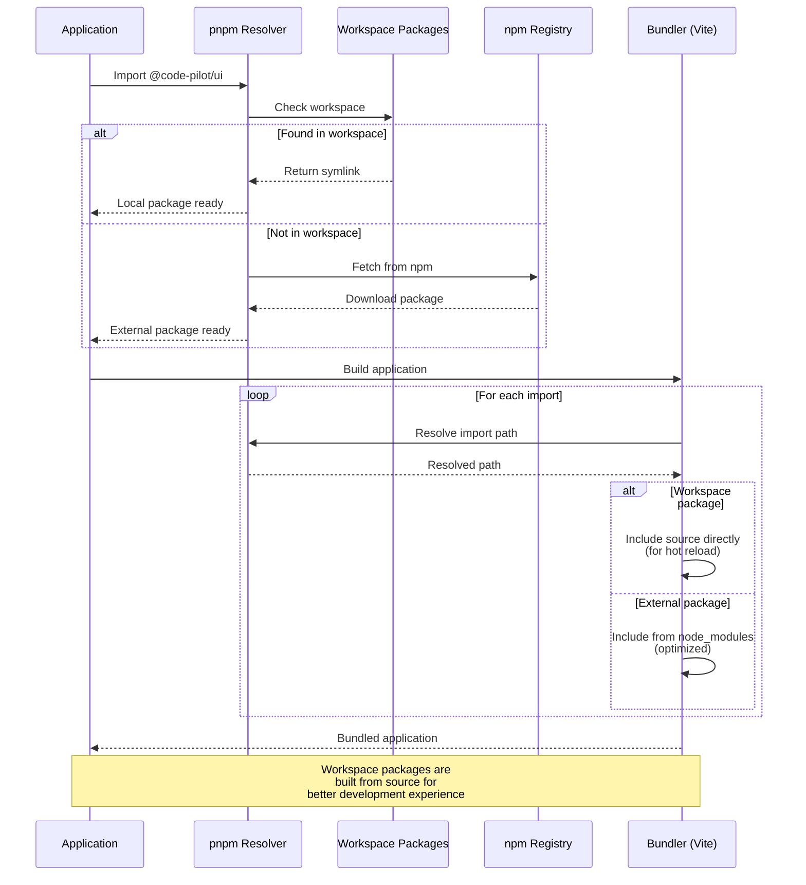

# Apps Directory

This directory contains all application packages for Code Pilot Studio v2.

## Overview

The `apps` directory houses the different application targets for the project. Currently, it contains the desktop application built with Tauri, with plans for future web and mobile versions.

```mermaid
graph TB
    subgraph "Applications Architecture"
        A[Apps Directory] --> B[Desktop App<br/>✅ Active]
        A --> C[Web App<br/>📅 Planned]
        A --> D[Mobile App<br/>📅 Planned]
        
        B --> B1[React Frontend]
        B --> B2[Rust/Tauri Backend]
        B --> B3[Native File Access]
        B --> B4[Full IDE Features]
        
        C --> C1[Browser-based IDE]
        C --> C2[Cloud Storage]
        C --> C3[Collaborative Features]
        C --> C4[WebAssembly]
        
        D --> D1[Project Viewing]
        D --> D2[Quick Edits]
        D --> D3[AI Chat Interface]
        D --> D4[Desktop Sync]
        
        subgraph "Shared Dependencies"
            E[@code-pilot/core]
            F[@code-pilot/ui]
            G[@code-pilot/types]
            H[@code-pilot/utils]
        end
        
        B1 --> E
        B1 --> F
        B1 --> G
        B1 --> H
        
        C1 -.-> E
        C1 -.-> F
        C1 -.-> G
        C1 -.-> H
        
        D1 -.-> E
        D1 -.-> F
        D1 -.-> G
        D1 -.-> H
    end
    
    style A fill:#2E86AB,stroke:#1A5276,color:#fff
    style B fill:#27AE60,stroke:#1E8449,color:#fff
    style C fill:#F39C12,stroke:#D68910,color:#fff
    style D fill:#E74C3C,stroke:#C0392B,color:#fff
    style E fill:#8E44AD,stroke:#6C3483,color:#fff
    style F fill:#3498DB,stroke:#2874A6,color:#fff
    style G fill:#16A085,stroke:#0E6655,color:#fff
    style H fill:#E67E22,stroke:#BA4A00,color:#fff
```

## Structure

```
apps/
├── desktop/     # Tauri desktop application (current)
├── web/         # Web application (planned)
└── mobile/      # Mobile application (planned)
```

## Applications

### Desktop (Active)
The main Tauri-based desktop application combining:
- **Frontend**: React + TypeScript + Vite
- **Backend**: Rust + Tauri 2.0
- **Features**: Full IDE functionality with native file system access

See [desktop/README.md](./desktop/README.md) for detailed information.

### Web (Planned)
Future web-based version of Code Pilot Studio:
- Browser-based IDE
- Cloud project storage
- Collaborative features
- WebAssembly for performance

### Mobile (Planned)
Mobile companion app:
- Project viewing
- Quick edits
- AI chat interface
- Sync with desktop

## Development

Each application follows the monorepo structure and shares:
- Core business logic from `@code-pilot/core`
- UI components from `@code-pilot/ui`
- Type definitions from `@code-pilot/types`
- Utilities from `@code-pilot/utils`

## Commands

Run from the project root:

```bash
# Desktop app
cd apps/desktop && pnpm tauri:dev

# Future web app
cd apps/web && pnpm dev

# Future mobile app
cd apps/mobile && pnpm dev
```

## Architecture Decisions

1. **Separate Apps**: Each platform gets its own app for optimal performance
2. **Shared Packages**: Maximum code reuse through shared packages
3. **Platform-Specific**: Each app can have platform-specific features
4. **Progressive Enhancement**: Start with desktop, expand to web/mobile

## Package Build Flow

This diagram shows how applications are built in the monorepo, including dependency resolution and bundling.

```mermaid
graph TD
    subgraph "Build Orchestration"
        Turbo[Turbo Build]
        Cache[Build Cache]
        Order[Dependency Order]
    end
    
    subgraph "Package Build"
        Utils[@code-pilot/utils<br/>Build First]
        Types[@code-pilot/types<br/>Depends on Utils]
        Core[@code-pilot/core<br/>Depends on Types & Utils]
        UI[@code-pilot/ui<br/>Depends on All]
    end
    
    subgraph "App Build"
        Desktop[Desktop App<br/>Vite + Tauri]
        Web[Web App<br/>Vite/Next.js]
        Mobile[Mobile App<br/>React Native]
    end
    
    subgraph "Build Steps"
        Clean[Clean Output]
        TSC[TypeScript Compile]
        Bundle[Bundle Assets]
        Optimize[Optimize]
        Package[Package App]
    end
    
    Turbo --> Cache
    Cache -->|Check| Order
    Order --> Utils
    
    Utils -->|Success| Types
    Types -->|Success| Core
    Core -->|Success| UI
    
    UI -->|All Built| Desktop
    UI -->|All Built| Web
    UI -->|All Built| Mobile
    
    Desktop --> Clean
    Web --> Clean
    Mobile --> Clean
    
    Clean --> TSC
    TSC --> Bundle
    Bundle --> Optimize
    Optimize --> Package
    
    Package -->|Desktop| Tauri[Tauri Bundle<br/>.app/.exe/.deb]
    Package -->|Web| Static[Static Files<br/>dist/]
    Package -->|Mobile| APK[APK/IPA<br/>Binary]
    
    style Turbo fill:#ff6b6b,stroke:#ff4444
    style Utils fill:#4ecdc4,stroke:#3ba99c
    style Types fill:#45b7d1,stroke:#3498db
    style Core fill:#96ceb4,stroke:#6fa67c
    style UI fill:#feca57,stroke:#f39c12
```

## Dependency Resolution Flow

This diagram illustrates how dependencies are resolved between apps and packages in the workspace.



## Adding New Apps

To add a new application:

1. Create directory under `apps/`
2. Initialize with appropriate framework
3. Add workspace reference in root `pnpm-workspace.yaml`
4. Import shared packages as needed
5. Configure build pipeline in `turbo.json`