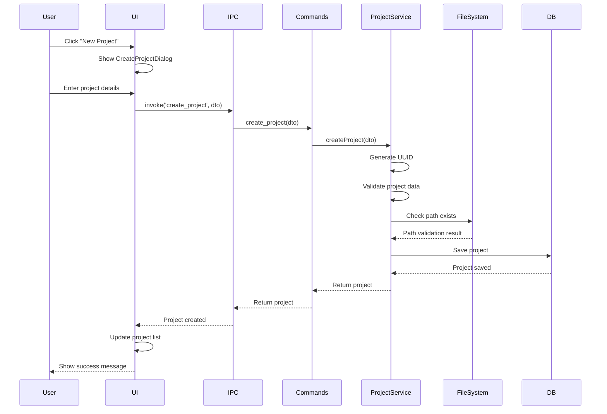
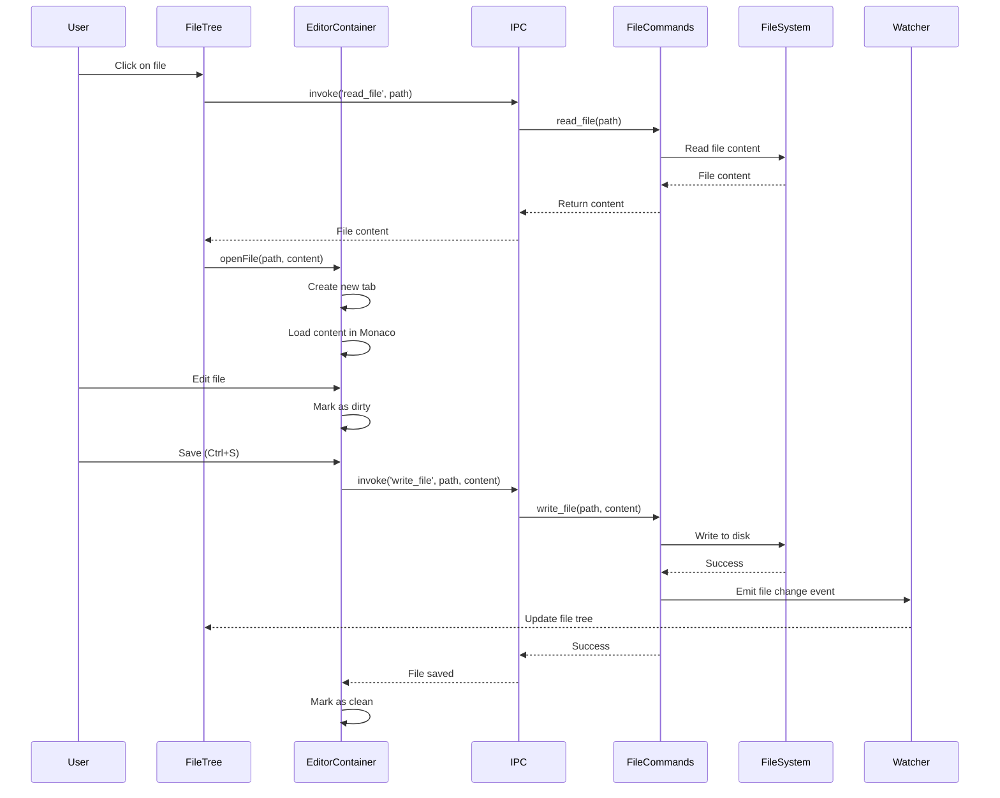
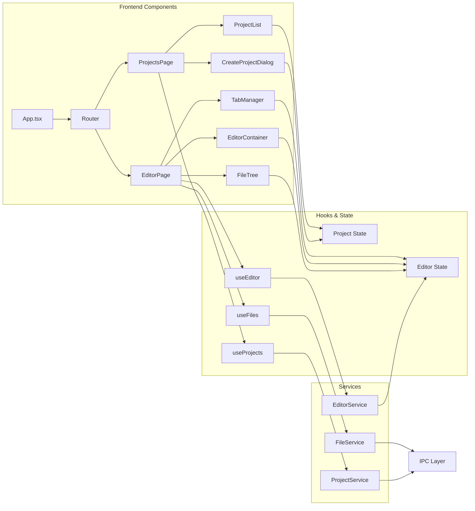
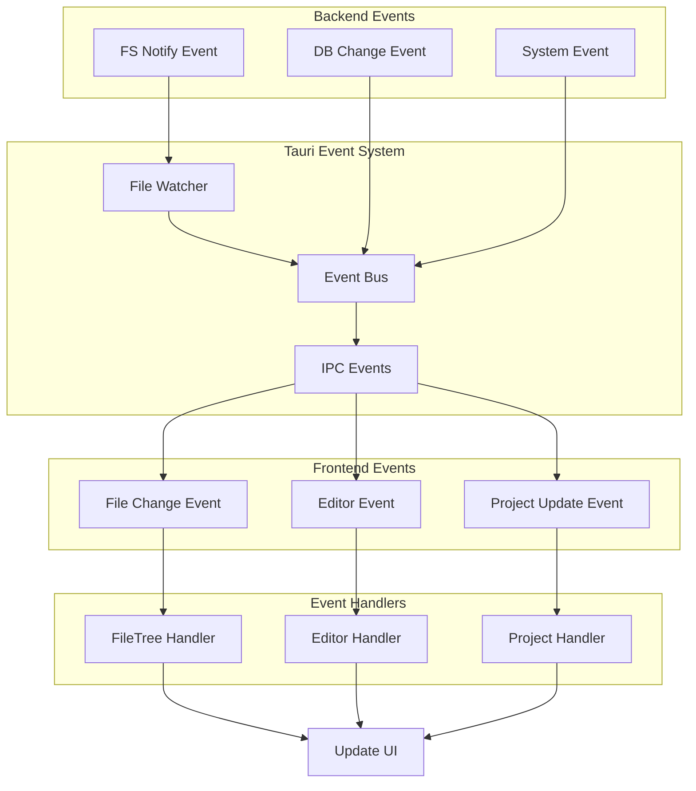
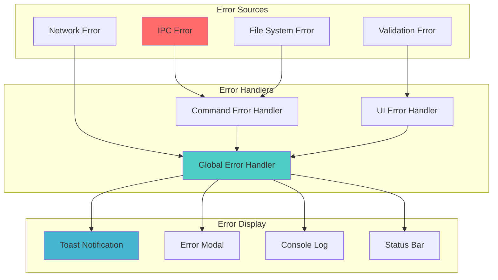
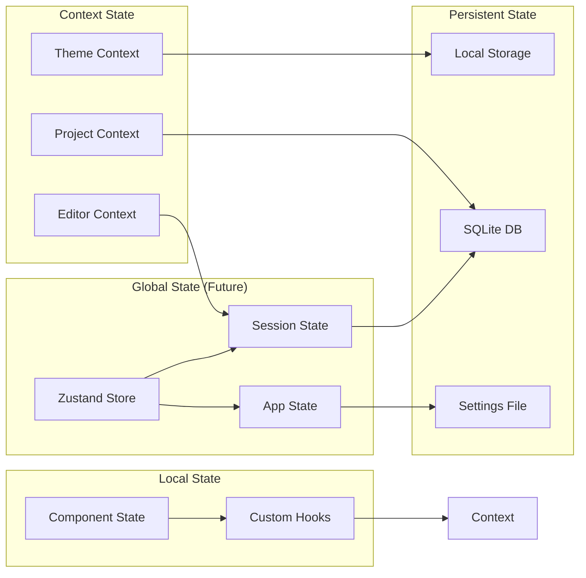

# Desktop Application

This is the main Tauri desktop application for Code Pilot Studio v2.

## Overview

The desktop app combines a React frontend with a Rust backend via Tauri 2.0 to create a native desktop experience with web technologies.

## Architecture Diagram

```mermaid
graph TB
    subgraph "Frontend (React + TypeScript)"
        UI[UI Layer]
        Pages[Pages/Routing]
        Components[Components]
        Hooks[Custom Hooks]
        IPC[IPC Client]
    end
    
    subgraph "Tauri Bridge"
        Bridge[IPC Bridge]
        Events[Event System]
    end
    
    subgraph "Backend (Rust)"
        Commands[Command Handlers]
        Services[Business Services]
        DB[Database Layer]
        FS[File System]
        Models[Domain Models]
    end
    
    subgraph "External Systems"
        SQLite[(SQLite DB)]
        FileSystem[File System]
        OS[OS APIs]
    end
    
    UI --> Pages
    Pages --> Components
    Components --> Hooks
    Pages --> IPC
    IPC <--> Bridge
    Bridge <--> Commands
    Commands --> Services
    Services --> DB
    Services --> FS
    DB --> Models
    DB --> SQLite
    FS --> FileSystem
    Commands --> OS
    
    style UI fill:#61dafb
    style Bridge fill:#1a1a1a
    style Commands fill:#ce422b
    style SQLite fill:#003b57
```



## Data Flow Diagrams

### Project Creation Flow



### File Operations Flow



### Component Interaction Flow



### Event System Flow



### Error Handling Flow



### State Management Flow



## Structure

```
desktop/
├── src/                    # React frontend application
│   ├── components/        # React components
│   ├── pages/            # Page components (routing)
│   ├── hooks/            # Custom React hooks
│   ├── lib/              # Utilities and helpers
│   ├── App.tsx           # Main app component
│   └── main.tsx          # Entry point
├── src-tauri/            # Rust backend application
│   ├── src/
│   │   ├── commands/     # Tauri command handlers
│   │   ├── db/          # Database models and migrations
│   │   ├── services/    # Business logic services
│   │   └── lib.rs       # Main library entry
│   ├── migrations/      # SQLite database migrations
│   └── Cargo.toml       # Rust dependencies
├── index.html           # HTML entry point
├── package.json         # Node dependencies
└── vite.config.ts       # Vite configuration
```

## Development

### Prerequisites
- Node.js 18+
- Rust (latest stable)
- pnpm

### Commands

```bash
# Install dependencies
pnpm install

# Run in development mode
pnpm tauri:dev

# Build for production
pnpm tauri:build

# Run frontend only (without Tauri)
pnpm dev

# Lint code
pnpm lint

# Run tests
pnpm test
```

## Frontend (React + TypeScript)

### Key Technologies
- **React 18.3** - UI framework
- **TypeScript** - Type safety
- **Vite 6** - Build tool and dev server
- **Tailwind CSS 4** - Styling
- **Monaco Editor** - Code editing capabilities
- **xterm.js** - Terminal emulation

### Features
- Project management UI
- File explorer with tree view
- Code editor (Monaco) with syntax highlighting
- Terminal integration with xterm.js
- Git integration UI (status, diff, commits)
- AI chat interface for Claude integration
- Dark/light theme support
- Settings and preferences management
- Advanced tab management with split panes
- Keyboard shortcuts system
- Tauri IPC integration

### IPC Communication
Frontend communicates with the backend using Tauri's IPC system:
```typescript
import { invoke } from '@tauri-apps/api/core';

// Example: Create a project
const project = await invoke('create_project', { 
  name: 'My Project',
  path: '/path/to/project'
});
```

## Backend (Rust + Tauri)

### Key Technologies
- **Tauri 2.0** - Desktop app framework
- **Tokio** - Async runtime
- **SQLx** - Database access (SQLite)
- **Serde** - Serialization
- **Notify** - File system watching
- **portable-pty** - Cross-platform PTY support
- **git2** - Git operations via libgit2 (compilation issues)
- **crossbeam-channel** - Multi-threaded communication

### Commands Available
- **Project Management**
  - `create_project` - Create a new project
  - `get_projects` - List all projects
  - `get_project` - Get a single project
  - `update_project` - Update project details
  - `delete_project` - Remove a project

- **File System Operations**
  - `read_directory` - List directory contents
  - `read_file` - Read file contents
  - `write_file` - Write to a file
  - `create_file` - Create new file
  - `delete_file` - Delete a file
  - `rename_file` - Rename/move file
  - `copy_file` - Copy file
  - `move_file` - Move file
  - `search_files` - Search for files
  - `get_file_stats` - Get file metadata
  - `watch_directory` - Watch for changes

- **Plugin Commands** (via Tauri plugins)
  - **Terminal Plugin** (`plugin:terminal|*`)
    - `create_terminal` - Create new terminal session
    - `write_terminal` - Send input to terminal
    - `resize_terminal` - Resize terminal dimensions
    - `close_terminal` - Close terminal session
  - **Git Plugin** (`plugin:git|*`)
    - `git_status` - Get repository status
    - `git_commit` - Create a commit
    - `git_branch` - Manage branches
    - `git_diff` - Get file diffs
  - **Claude Plugin** (`plugin:claude|*`)
    - `create_session` - Start Claude session
    - `send_message` - Send message to Claude
    - `get_sessions` - List active sessions

### Database
Currently uses in-memory storage, but SQLite integration is prepared:
- Migration system ready
- Database models defined
- Will store projects, sessions, and settings

## Configuration

### Environment Variables
- `RUST_LOG` - Set logging level for Rust backend
- `NODE_ENV` - Development/production mode

### Build Configuration
- See `tauri.conf.json` for Tauri-specific settings
- See `vite.config.ts` for frontend build settings

## Architecture Decisions

1. **Tauri 2.0** - Provides native performance with web technologies
2. **IPC Pattern** - Type-safe communication between frontend and backend
3. **Monaco Editor** - Industry-standard code editing experience
4. **SQLite** - Lightweight, embedded database for local storage
5. **File System Access** - Direct file operations for IDE functionality

## Testing

- Frontend tests use Vitest
- Backend tests use Rust's built-in testing
- E2E tests planned with Playwright

## Security

- Tauri provides sandboxed environment
- File system access is controlled
- No remote code execution
- Secure IPC communication