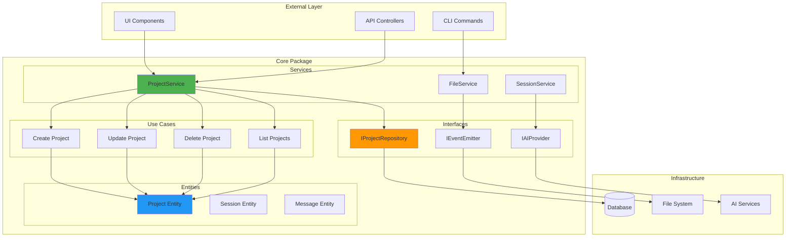
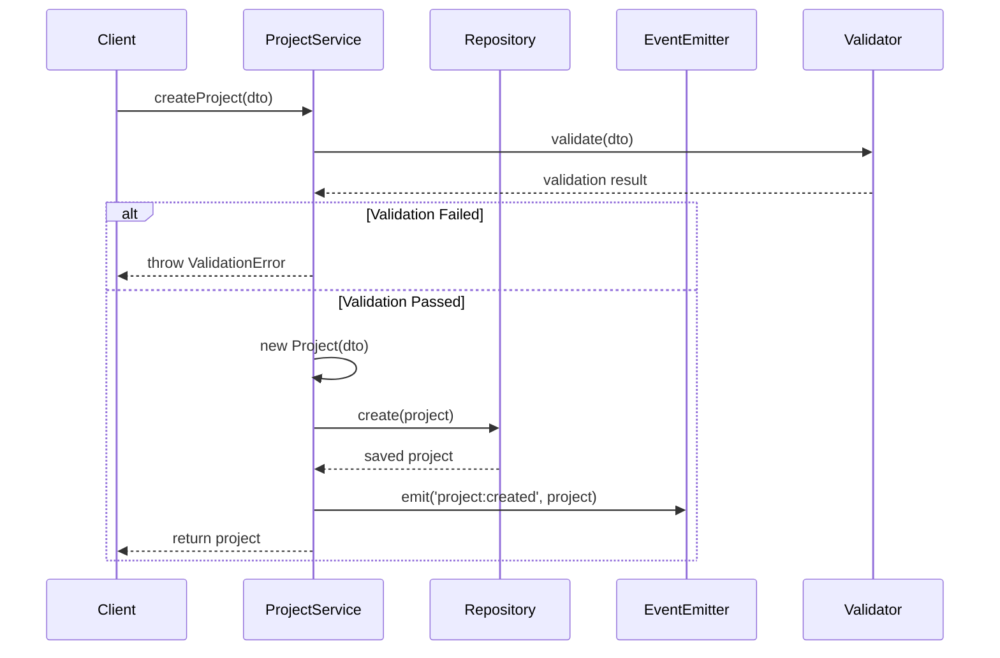
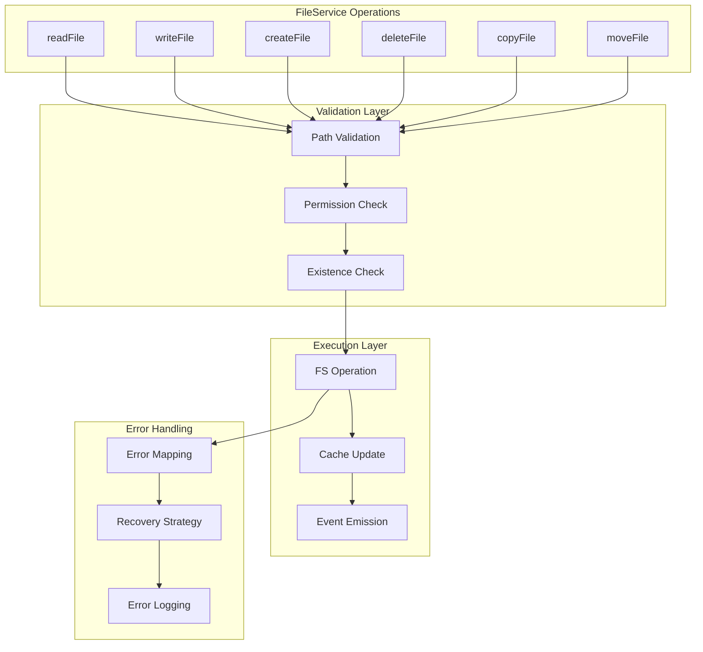
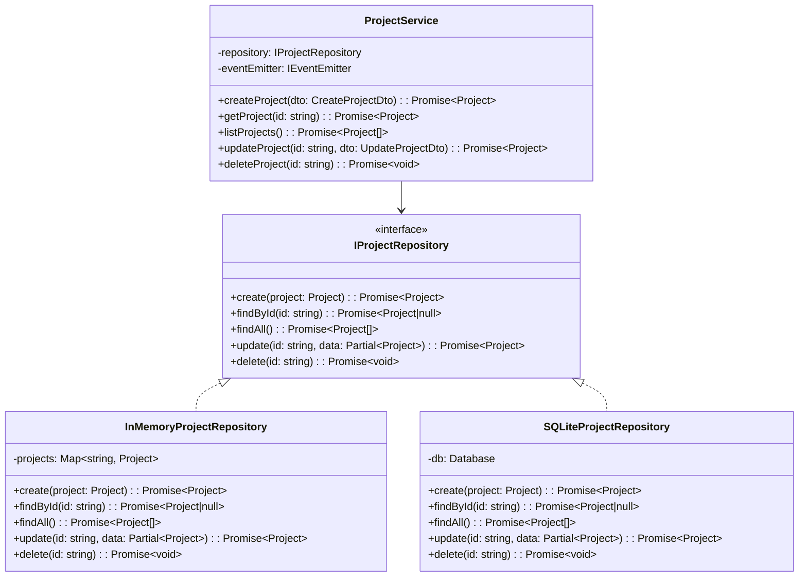
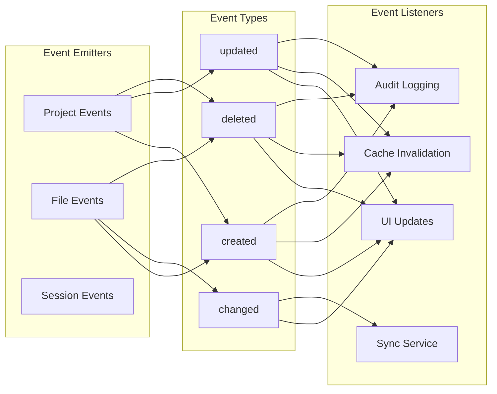
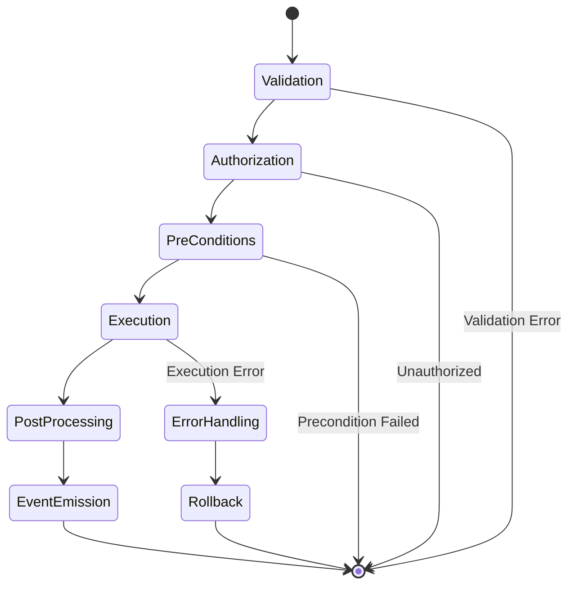

# Core Package

The core business logic package for Code Pilot Studio v2, implementing clean architecture principles.

## Overview

This package contains all the business logic, domain entities, and use cases that are independent of any UI framework or infrastructure. It follows clean architecture patterns to ensure maintainability and testability.

## Architecture Diagram



## Service Logic Flows

### ProjectService Data Flow



### FileService Operation Flow



### Repository Pattern Implementation



### Event-Driven Architecture



### Use Case Execution Flow



## Structure

```
core/
├── src/
│   ├── entities/        # Domain entities
│   │   ├── project.ts   # Project entity
│   │   └── session.ts   # Session entity (planned)
│   ├── use-cases/       # Business use cases
│   │   └── project/     # Project-related use cases
│   ├── interfaces/      # Port interfaces (repository patterns)
│   │   └── repositories.ts
│   ├── services/        # Business services
│   │   ├── project.service.ts  # Project management service
│   │   └── file.service.ts     # File operations service
│   └── index.ts         # Main exports
├── package.json
└── tsconfig.json
```

## Key Concepts

### Entities
Domain models that represent the core business concepts:
- **Project**: Represents a code project with metadata
- **Session**: AI conversation session (planned)
- **Message**: Chat messages (planned)

### Use Cases
Business operations that can be performed:
- Create, read, update, delete projects
- Validate project configurations
- Manage project lifecycle

### Interfaces (Ports)
Abstractions for external dependencies:
```typescript
interface IProjectRepository {
  create(project: Project): Promise<Project>
  findById(id: string): Promise<Project | null>
  findAll(): Promise<Project[]>
  update(id: string, data: Partial<Project>): Promise<Project>
  delete(id: string): Promise<void>
}
```

### Services
Business logic implementation:
- **ProjectService**: Handles all project-related operations
- **FileService**: Manages file system operations

## Usage

```typescript
import { ProjectService, Project } from '@code-pilot/core';

// Initialize service with repository
const projectService = new ProjectService(projectRepository, eventEmitter);

// Create a project
const project = await projectService.createProject({
  name: 'My Project',
  path: '/path/to/project',
  description: 'A new project'
});

// List all projects
const projects = await projectService.listProjects();
```

## Dependencies

- `@code-pilot/types` - Shared TypeScript types
- `uuid` - For generating unique IDs
- `@tauri-apps/api` - For file system operations

## Architecture Principles

1. **Dependency Inversion**: Services depend on interfaces, not implementations
2. **Single Responsibility**: Each class has one reason to change
3. **Open/Closed**: Open for extension, closed for modification
4. **Interface Segregation**: Small, focused interfaces
5. **Liskov Substitution**: Implementations are interchangeable

## Testing

The core package is designed to be highly testable:
- All dependencies are injected
- Business logic is isolated from infrastructure
- Mock implementations can be easily created

```typescript
// Example test setup
const mockRepository: IProjectRepository = {
  create: vi.fn(),
  findById: vi.fn(),
  // ... other methods
};

const service = new ProjectService(mockRepository, mockEventEmitter);
```

## Future Enhancements

- Session management logic
- AI provider abstractions
- Plugin system core
- Advanced project templates
- Workspace management
- User preferences handling