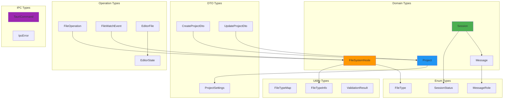

# Types Package

Shared TypeScript type definitions for Code Pilot Studio v2.

## Overview

This package contains all shared TypeScript types, interfaces, and enums used across the monorepo. It ensures type safety and consistency throughout the application.

## Type Hierarchy



## Structure

```
types/
├── src/
│   ├── project.ts       # Project-related types
│   ├── filesystem.ts    # File system types
│   ├── editor.ts        # Editor-related types
│   ├── ai.ts           # AI/Chat types (planned)
│   ├── session.ts      # Session types (planned)
│   └── index.ts        # Main exports
├── package.json
└── tsconfig.json
```

## Type Categories

### Project Types
```typescript
interface Project {
  id: string;
  name: string;
  path: string;
  description?: string;
  createdAt: Date;
  updatedAt: Date;
  lastOpenedAt?: Date;
  settings?: ProjectSettings;
  tags?: string[];
  favorite?: boolean;
}

interface ProjectSettings {
  defaultBranch?: string;
  excludePaths?: string[];
  customCommands?: Record<string, string>;
}

interface CreateProjectDto {
  name: string;
  path: string;
  description?: string;
  template?: string;
  gitInit?: boolean;
}
```

### File System Types
```typescript
interface FileSystemNode {
  id: string;
  name: string;
  path: string;
  type: 'file' | 'directory';
  size?: number;
  modified?: Date;
  created?: Date;
  extension?: string;
  children?: FileSystemNode[];
  expanded?: boolean;
  isVirtual?: boolean;
  content?: string;
}

interface FileOperation {
  type: 'create' | 'update' | 'delete' | 'rename' | 'move' | 'copy';
  path: string;
  newPath?: string;
  content?: string;
  timestamp: Date;
}

interface FileWatchEvent {
  type: 'created' | 'modified' | 'deleted' | 'renamed';
  path: string;
  oldPath?: string;
  timestamp: Date;
}
```

### Editor Types
```typescript
interface EditorFile {
  id: string;
  path: string;
  content: string;
  language?: string;
  isDirty: boolean;
  isReadOnly?: boolean;
  encoding?: string;
  lineEnding?: 'lf' | 'crlf';
}

interface EditorState {
  activeFileId?: string;
  openFiles: EditorFile[];
  recentFiles: string[];
  breakpoints?: Map<string, number[]>;
}

interface EditorOptions {
  theme?: string;
  fontSize?: number;
  tabSize?: number;
  wordWrap?: boolean;
  minimap?: boolean;
  lineNumbers?: boolean;
}
```

### Session & AI Types (Planned)
```typescript
interface Session {
  id: string;
  projectId?: string;
  title: string;
  messages: Message[];
  status: SessionStatus;
  createdAt: Date;
  updatedAt: Date;
  metadata?: Record<string, any>;
}

interface Message {
  id: string;
  role: 'user' | 'assistant' | 'system';
  content: string;
  timestamp: Date;
  metadata?: MessageMetadata;
}

interface MessageMetadata {
  model?: string;
  tokens?: number;
  cost?: number;
  toolCalls?: ToolCall[];
}

enum SessionStatus {
  Active = 'active',
  Archived = 'archived',
  Deleted = 'deleted'
}
```

### IPC Types
```typescript
interface TauriCommand<T = any, R = any> {
  name: string;
  payload: T;
  response: R;
}

interface IpcError {
  code: string;
  message: string;
  details?: any;
}
```

## File Type Mappings

The package includes comprehensive file type mappings with icons:

```typescript
export const fileTypeMap: Record<string, FileTypeInfo> = {
  // Languages
  '.ts': { icon: 'FileCode2', color: 'text-blue-400', category: 'code' },
  '.tsx': { icon: 'FileCode2', color: 'text-blue-400', category: 'code' },
  '.js': { icon: 'FileCode2', color: 'text-yellow-400', category: 'code' },
  '.jsx': { icon: 'FileCode2', color: 'text-yellow-400', category: 'code' },
  '.py': { icon: 'FileCode2', color: 'text-blue-300', category: 'code' },
  '.rs': { icon: 'FileCode2', color: 'text-orange-500', category: 'code' },
  
  // Data formats
  '.json': { icon: 'FileJson2', color: 'text-yellow-500', category: 'data' },
  '.xml': { icon: 'FileCode', color: 'text-orange-400', category: 'data' },
  '.yaml': { icon: 'FileText', color: 'text-red-400', category: 'data' },
  
  // Documents
  '.md': { icon: 'FileText', color: 'text-gray-400', category: 'document' },
  '.pdf': { icon: 'FileText', color: 'text-red-500', category: 'document' },
  
  // Media
  '.png': { icon: 'FileImage', color: 'text-purple-400', category: 'media' },
  '.jpg': { icon: 'FileImage', color: 'text-purple-400', category: 'media' },
  '.svg': { icon: 'FileImage', color: 'text-purple-500', category: 'media' },
  
  // ... 100+ more file types
};
```

## Usage

### Import Types
```typescript
import type { 
  Project, 
  FileSystemNode, 
  Session, 
  Message 
} from '@code-pilot/types';
```

### Type Guards
```typescript
// Check if a node is a file
export function isFile(node: FileSystemNode): boolean {
  return node.type === 'file';
}

// Check if a file is a code file
export function isCodeFile(extension: string): boolean {
  return fileTypeMap[extension]?.category === 'code';
}
```

## Benefits

1. **Type Safety**: Catch errors at compile time
2. **IntelliSense**: Better IDE support and autocompletion
3. **Documentation**: Types serve as documentation
4. **Refactoring**: Easier to refactor with confidence
5. **Consistency**: Same types used across all packages

## Best Practices

1. **Use Type Imports**: Always use `import type` for type-only imports
2. **Avoid Any**: Use specific types instead of `any`
3. **Document Complex Types**: Add JSDoc comments for clarity
4. **Export Guards**: Export type guard functions
5. **Versioning**: Consider type versioning for API changes

## Future Additions

- Plugin API types
- Theme configuration types
- Keyboard shortcut types
- Extension manifest types
- Language server protocol types
- Debug adapter protocol types
- Terminal types
- Search and replace types