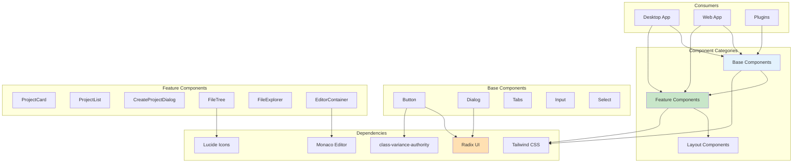

# UI Package

Shared React component library for Code Pilot Studio v2.

## Overview

This package contains all reusable UI components built with React, TypeScript, Radix UI primitives, and Tailwind CSS. Components are designed to be accessible, themeable, and composable.

## Component Architecture



## Structure

```
ui/
├── src/
│   ├── components/          # UI components
│   │   ├── Button/         # Button component
│   │   ├── Dialog/         # Dialog component
│   │   ├── Tabs/           # Tabs component
│   │   ├── Project/        # Project-related components
│   │   ├── FileExplorer/   # File tree and explorer
│   │   └── Editor/         # Monaco editor wrapper
│   ├── theme/              # Theme configuration
│   ├── lib/                # Utilities
│   │   └── utils.ts        # Helper functions
│   └── index.ts            # Main exports
├── package.json
└── tsconfig.json
```

## Components

### Base Components

#### Button
A versatile button component with multiple variants:
```tsx
import { Button } from '@code-pilot/ui';

<Button variant="primary" size="md" onClick={handleClick}>
  Click me
</Button>
```

#### Dialog
Modal dialog using Radix UI:
```tsx
import { Dialog } from '@code-pilot/ui';

<Dialog
  open={isOpen}
  onOpenChange={setIsOpen}
  title="Dialog Title"
  description="Dialog description"
>
  <DialogContent />
</Dialog>
```

#### Tabs
Tab navigation component:
```tsx
import { Tabs } from '@code-pilot/ui';

<Tabs defaultValue="tab1">
  <TabsList>
    <TabsTrigger value="tab1">Tab 1</TabsTrigger>
    <TabsTrigger value="tab2">Tab 2</TabsTrigger>
  </TabsList>
  <TabsContent value="tab1">Content 1</TabsContent>
  <TabsContent value="tab2">Content 2</TabsContent>
</Tabs>
```

### Feature Components

#### CreateProjectDialog
Complete project creation flow:
```tsx
import { CreateProjectDialog } from '@code-pilot/ui';

<CreateProjectDialog
  open={isOpen}
  onOpenChange={setIsOpen}
  onProjectCreate={handleProjectCreate}
/>
```

#### ProjectCard & ProjectList
Project display components:
```tsx
import { ProjectList } from '@code-pilot/ui';

<ProjectList
  projects={projects}
  onProjectSelect={handleSelect}
  onProjectDelete={handleDelete}
/>
```

#### FileTree & FileExplorer
File system navigation:
```tsx
import { FileTree } from '@code-pilot/ui';

<FileTree
  rootPath="/path/to/project"
  onFileSelect={handleFileSelect}
  onFileOpen={handleFileOpen}
/>
```

#### EditorContainer
Monaco editor integration:
```tsx
import { EditorContainer } from '@code-pilot/ui';

<EditorContainer
  ref={editorRef}
  fileService={fileService}
  onFileChange={handleFileChange}
/>
```

## Styling

### Tailwind CSS
All components use Tailwind CSS v4 for styling:
- Utility-first approach
- Dark mode support
- Responsive design
- Custom color palette

### Theme System
Components support theming through CSS variables:
```css
:root {
  --primary: 220 13% 69%;
  --background: 0 0% 100%;
  --foreground: 222.2 84% 4.9%;
  /* ... more variables */
}
```

### Class Variance Authority
Used for component variants:
```typescript
const buttonVariants = cva(
  "inline-flex items-center justify-center",
  {
    variants: {
      variant: {
        primary: "bg-primary text-white",
        secondary: "bg-secondary text-secondary-foreground",
      },
      size: {
        sm: "h-8 px-3 text-sm",
        md: "h-10 px-4",
        lg: "h-12 px-6 text-lg",
      },
    },
  }
);
```

## Dependencies

### Radix UI Primitives
- `@radix-ui/react-dialog` - Accessible dialog
- `@radix-ui/react-dropdown-menu` - Dropdown menus
- `@radix-ui/react-tabs` - Tab navigation

### Icons
- `lucide-react` - Modern icon library

### Editor
- `@monaco-editor/react` - Monaco editor wrapper
- `monaco-editor` - Core editor

### Utilities
- `class-variance-authority` - Variant management
- `clsx` - Class name utilities
- `tailwind-merge` - Merge Tailwind classes

## Usage

### Installation
Components are available through the workspace:
```json
{
  "dependencies": {
    "@code-pilot/ui": "workspace:*"
  }
}
```

### Import Components
```typescript
import { 
  Button, 
  Dialog, 
  ProjectList,
  FileTree,
  EditorContainer 
} from '@code-pilot/ui';
```

## Development

### Component Guidelines
1. Use TypeScript for all components
2. Include proper prop types
3. Support controlled and uncontrolled modes
4. Ensure accessibility (ARIA labels, keyboard navigation)
5. Support dark mode
6. Write component documentation

### Testing
- Unit tests with Vitest
- Component testing planned
- Accessibility testing

### Storybook
Component development and documentation:
```bash
pnpm storybook
```

## Future Enhancements

- Terminal component
- Settings panels
- Command palette
- Status bar
- Split pane layouts
- Context menus
- Toast notifications
- Loading states
- Error boundaries