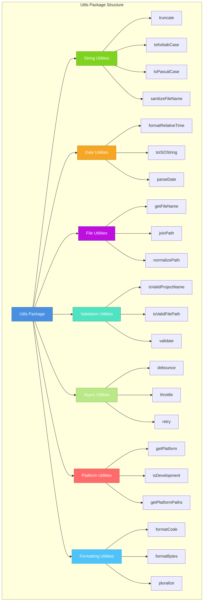
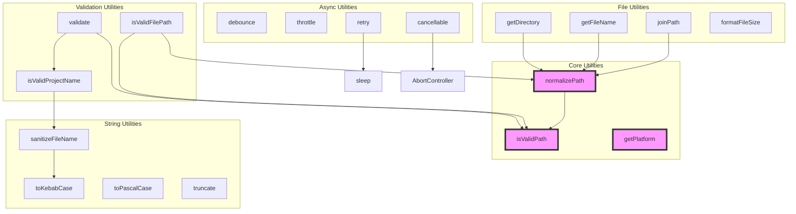
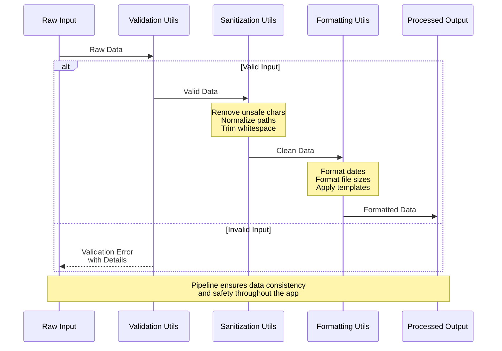
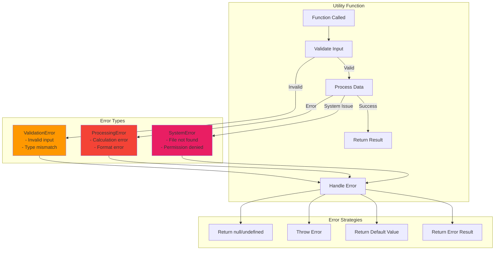
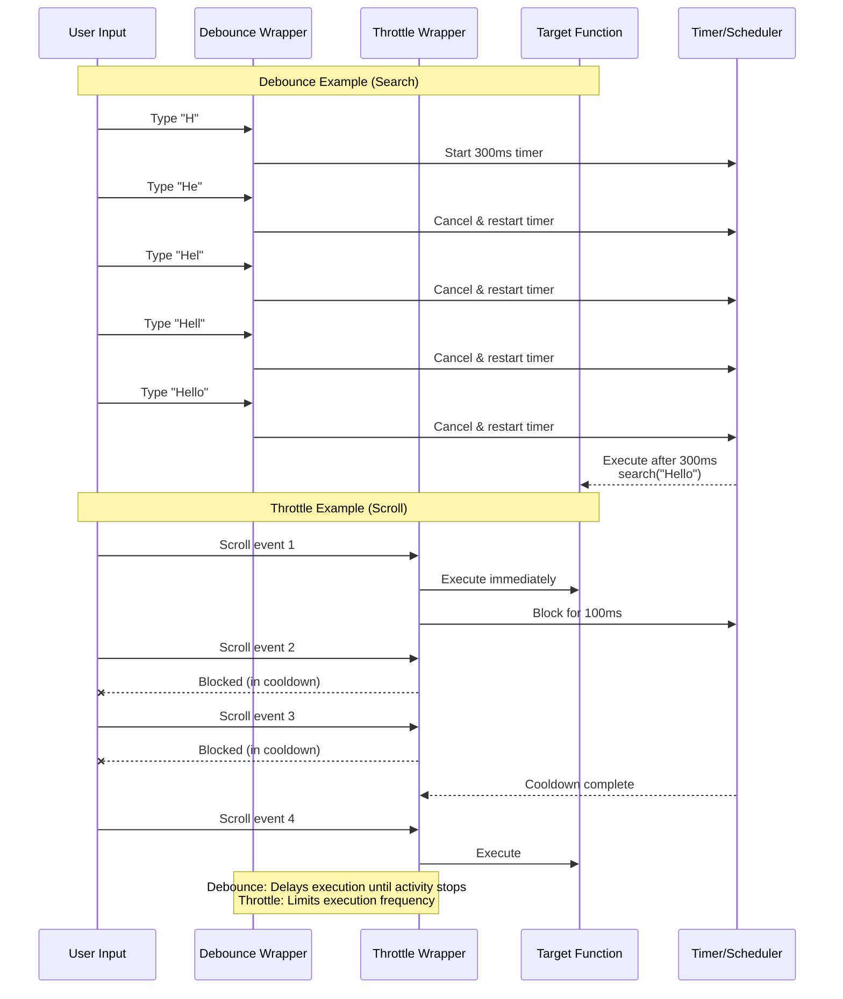

# Utils Package

Shared utility functions and helpers for Code Pilot Studio v2.

## Overview

This package contains common utility functions, helpers, and constants used across the monorepo. It provides reusable functionality to avoid code duplication.



## Structure

```
utils/
├── src/
│   ├── string.ts        # String manipulation utilities
│   ├── date.ts          # Date formatting and manipulation
│   ├── file.ts          # File path and extension utilities
│   ├── validation.ts    # Input validation functions
│   ├── formatting.ts    # Code and text formatting
│   ├── async.ts         # Async utilities
│   ├── platform.ts      # Platform-specific helpers
│   └── index.ts         # Main exports
├── package.json
└── tsconfig.json
```

## Utility Categories

### String Utilities
```typescript
// Truncate string with ellipsis
export function truncate(str: string, maxLength: number): string

// Convert to kebab-case
export function toKebabCase(str: string): string

// Convert to PascalCase
export function toPascalCase(str: string): string

// Sanitize file names
export function sanitizeFileName(name: string): string

// Extract file extension
export function getFileExtension(path: string): string
```

### Date Utilities
```typescript
// Format date to relative time (e.g., "2 hours ago")
export function formatRelativeTime(date: Date): string

// Format date to ISO string
export function toISOString(date: Date): string

// Parse various date formats
export function parseDate(dateString: string): Date

// Get time difference
export function getTimeDiff(start: Date, end: Date): Duration
```

### File Utilities
```typescript
// Get file name from path
export function getFileName(path: string): string

// Get directory from path
export function getDirectory(path: string): string

// Join paths safely
export function joinPath(...paths: string[]): string

// Check if path is absolute
export function isAbsolutePath(path: string): boolean

// Normalize path separators
export function normalizePath(path: string): string

// Get file size formatted
export function formatFileSize(bytes: number): string
```

### Validation Utilities
```typescript
// Validate project name
export function isValidProjectName(name: string): boolean

// Validate file path
export function isValidFilePath(path: string): boolean

// Validate URL
export function isValidUrl(url: string): boolean

// Validate email
export function isValidEmail(email: string): boolean

// Custom validation rules
export interface ValidationRule {
  test: (value: any) => boolean;
  message: string;
}

export function validate(value: any, rules: ValidationRule[]): ValidationResult
```

### Async Utilities
```typescript
// Debounce function calls
export function debounce<T extends (...args: any[]) => any>(
  func: T,
  wait: number
): (...args: Parameters<T>) => void

// Throttle function calls
export function throttle<T extends (...args: any[]) => any>(
  func: T,
  limit: number
): (...args: Parameters<T>) => void

// Retry failed operations
export async function retry<T>(
  fn: () => Promise<T>,
  options?: RetryOptions
): Promise<T>

// Create cancellable promise
export function cancellable<T>(
  promise: Promise<T>
): [Promise<T>, () => void]

// Sleep/delay
export function sleep(ms: number): Promise<void>
```

### Platform Utilities
```typescript
// Get current platform
export function getPlatform(): 'windows' | 'macos' | 'linux'

// Check if running in development
export function isDevelopment(): boolean

// Get platform-specific paths
export function getPlatformPaths(): PlatformPaths

// Platform-specific keyboard shortcuts
export function getPlatformShortcut(action: string): string
```

### Formatting Utilities
```typescript
// Format code with proper indentation
export function formatCode(code: string, language: string): string

// Convert bytes to human readable
export function formatBytes(bytes: number, decimals?: number): string

// Format numbers with separators
export function formatNumber(num: number): string

// Pluralize words
export function pluralize(count: number, singular: string, plural?: string): string
```

## Constants

```typescript
// File size units
export const FILE_SIZE_UNITS = ['B', 'KB', 'MB', 'GB', 'TB'] as const;

// Common file extensions by category
export const CODE_EXTENSIONS = ['.ts', '.js', '.py', '.rs', '.go'];
export const IMAGE_EXTENSIONS = ['.png', '.jpg', '.gif', '.svg'];
export const DOCUMENT_EXTENSIONS = ['.md', '.pdf', '.doc', '.txt'];

// Platform constants
export const IS_WINDOWS = process.platform === 'win32';
export const IS_MAC = process.platform === 'darwin';
export const IS_LINUX = process.platform === 'linux';
```

## Usage Examples

```typescript
import { 
  formatRelativeTime, 
  sanitizeFileName, 
  debounce,
  formatFileSize 
} from '@code-pilot/utils';

// Format dates
const timeAgo = formatRelativeTime(new Date('2024-01-01'));
// => "2 months ago"

// Sanitize file names
const safeName = sanitizeFileName('my<file>name?.txt');
// => "my-file-name.txt"

// Debounce search input
const debouncedSearch = debounce((query: string) => {
  searchFiles(query);
}, 300);

// Format file sizes
const size = formatFileSize(1536);
// => "1.5 KB"
```

## Best Practices

1. **Pure Functions**: Keep utilities pure without side effects
2. **Type Safety**: Use TypeScript generics where appropriate
3. **Error Handling**: Return meaningful errors or null/undefined
4. **Performance**: Optimize for common use cases
5. **Testing**: Write unit tests for all utilities
6. **Documentation**: Include JSDoc comments with examples

## Utility Function Dependencies

This diagram shows which utilities depend on others within the utils package.



## Data Transformation Flow

This diagram illustrates how utilities process and transform data throughout the application.



## Error Handling Flow

This diagram shows how errors are handled within utility functions.



## Performance Optimization Flow

This diagram illustrates how debounce and throttle utilities optimize performance.



## Testing

All utilities should have comprehensive unit tests:

```typescript
import { describe, test, expect } from 'vitest';
import { formatFileSize } from './file';

describe('formatFileSize', () => {
  test('formats bytes correctly', () => {
    expect(formatFileSize(0)).toBe('0 B');
    expect(formatFileSize(1024)).toBe('1 KB');
    expect(formatFileSize(1048576)).toBe('1 MB');
  });
});
```

## Future Additions

- Encryption utilities
- Color manipulation
- Performance monitoring
- Logger utilities
- Event emitter
- Object utilities (deep clone, merge)
- Array utilities
- Regular expression helpers
- UUID generation
- Hash functions