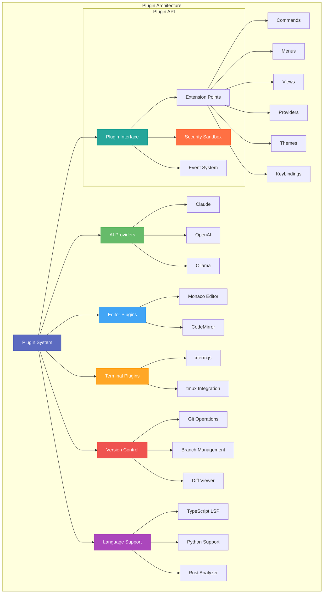

# Plugins Directory

This directory contains plugin packages for extending Code Pilot Studio v2 functionality.

## Overview

The plugin system allows third-party developers and users to extend the IDE with custom functionality. Plugins are isolated packages that interact with the core application through a well-defined API.



## Plugin Architecture

```
plugins/
├── ai-providers/       # AI service integrations
│   ├── claude/        # Anthropic Claude
│   ├── openai/        # OpenAI GPT models
│   └── ollama/        # Local LLM support
├── editors/           # Editor enhancements
│   ├── monaco/        # Monaco editor integration
│   └── codemirror/    # CodeMirror alternative
├── terminals/         # Terminal integrations
│   ├── xterm/         # xterm.js terminal
│   └── tmux/          # tmux integration
├── version-control/   # VCS integrations
│   └── git/          # Git operations
└── languages/        # Language support
    ├── typescript/   # TypeScript LSP
    ├── python/       # Python support
    └── rust/         # Rust analyzer
```

## Plugin Types

### AI Providers
Integrate different AI services:
- Chat completions
- Code generation
- Embeddings
- Tool/function calling

### Editor Plugins
Enhance code editing:
- Syntax highlighting
- Code completion
- Formatting
- Refactoring tools

### Terminal Plugins
Terminal emulation and integration:
- Shell integration
- Session management
- Command history
- Multiplexing

### Version Control
Source control operations:
- Commit/push/pull
- Branch management
- Diff viewing
- Merge conflict resolution

### Language Support
Programming language features:
- Language servers
- Debuggers
- Linters
- Formatters

## Plugin API

### Plugin Manifest
Each plugin must have a `plugin.json`:
```json
{
  "id": "code-pilot.git",
  "name": "Git Integration",
  "version": "1.0.0",
  "description": "Git version control integration",
  "author": "Code Pilot Team",
  "main": "./dist/index.js",
  "activationEvents": ["onStartup"],
  "contributes": {
    "commands": [
      {
        "command": "git.commit",
        "title": "Git: Commit"
      }
    ],
    "menus": {
      "editor/context": [
        {
          "command": "git.commit",
          "when": "resourceScheme == file"
        }
      ]
    }
  },
  "dependencies": {
    "@code-pilot/plugin-api": "^1.0.0"
  }
}
```

### Plugin Interface
```typescript
import { Plugin, PluginContext } from '@code-pilot/plugin-api';

export class GitPlugin implements Plugin {
  async activate(context: PluginContext): Promise<void> {
    // Register commands
    context.subscriptions.push(
      context.commands.registerCommand('git.commit', () => {
        this.commit();
      })
    );
    
    // Register providers
    context.registerGitProvider(this.gitProvider);
  }
  
  async deactivate(): Promise<void> {
    // Cleanup
  }
}
```

### Extension Points

Plugins can extend:
1. **Commands** - Add new commands
2. **Menus** - Add menu items
3. **Views** - Add sidebar panels
4. **Providers** - Language features, AI models
5. **Themes** - Color themes, icon themes
6. **Keybindings** - Custom shortcuts

## Development Guide

### Creating a Plugin

1. **Setup**
   ```bash
   mkdir plugins/my-plugin
   cd plugins/my-plugin
   pnpm init
   ```

2. **Install API**
   ```bash
   pnpm add @code-pilot/plugin-api
   ```

3. **Create manifest**
   ```json
   {
     "id": "my-company.my-plugin",
     "name": "My Plugin",
     "version": "1.0.0"
   }
   ```

4. **Implement plugin**
   ```typescript
   export class MyPlugin implements Plugin {
     activate(context: PluginContext) {
       // Plugin logic
     }
   }
   ```

### Plugin Lifecycle

1. **Discovery** - IDE scans plugin directories
2. **Loading** - Plugin manifest is read
3. **Activation** - Plugin is activated based on events
4. **Runtime** - Plugin responds to IDE events
5. **Deactivation** - Cleanup on disable/uninstall

### Security

Plugins run in a sandboxed environment:
- Limited file system access
- No network access without permission
- API calls are validated
- Resource usage monitored

## Publishing Plugins

Future plugin marketplace will support:
- Plugin discovery
- Ratings and reviews
- Automatic updates
- License verification

## Best Practices

1. **Performance**: Don't block the UI thread
2. **Error Handling**: Graceful degradation
3. **Documentation**: Clear README and examples
4. **Testing**: Unit and integration tests
5. **Versioning**: Follow semver
6. **Security**: Validate all inputs

## Examples

### Simple Command Plugin
```typescript
export class HelloPlugin implements Plugin {
  activate(context: PluginContext) {
    context.commands.registerCommand('hello.world', () => {
      context.window.showMessage('Hello, World!');
    });
  }
}
```

### AI Provider Plugin
```typescript
export class ClaudePlugin implements Plugin {
  activate(context: PluginContext) {
    context.ai.registerProvider({
      id: 'claude',
      name: 'Claude',
      chat: async (messages, options) => {
        // Implement Claude API calls
      }
    });
  }
}
```

## Roadmap

- [ ] Plugin API v1.0
- [ ] Sandboxing system
- [ ] Plugin marketplace
- [ ] Hot reload support
- [ ] Plugin dependencies
- [ ] WebAssembly plugins
- [ ] Remote plugins